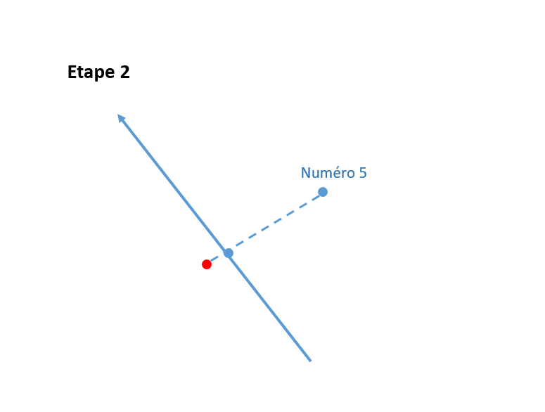
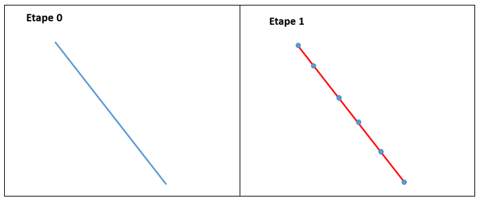
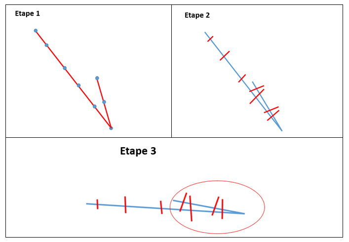
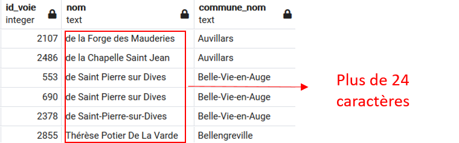
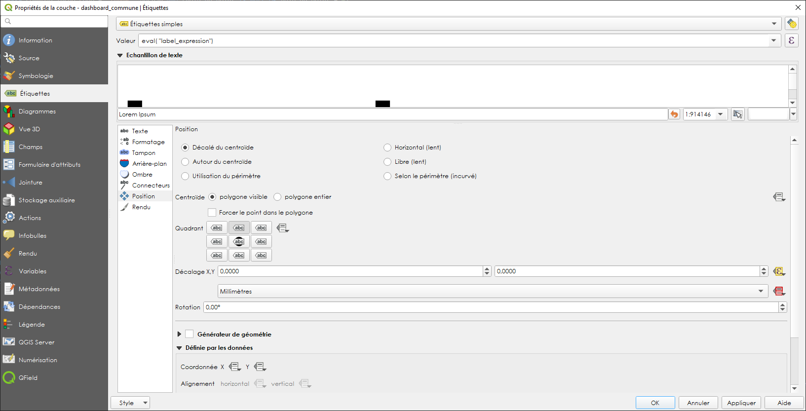
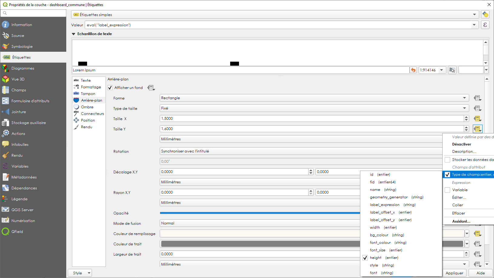
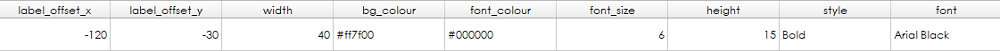
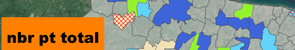

II- Application de saisie
*************************

1- Triggers et fonctions
=========================

1.1 Module d'aide à la numérotation
------------------------------------

Il existe deux types de numérotation différents :

* La numérotation **classique**

.. image:: ../img/adressage/numerotation_classique.png

Cette numérotation consiste à numéroter de deux en deux avec les numéros pairs à droite de la voie et les numéros impairs à gauche. C'est le système historique en France utilisé par une majorité des communes, notamment en ville.
L'inconvénient est que ce système n'est pas évolutif. En cas de nouvelles constructions s'intercalant entre deux numéros consécutifs il faut ajouter un numéro à extension (bis puis ter par exemple).

* La numérotation **métrique**

.. image:: ../img/adressage/numerotation_metrique.png

Ce second système consiste à calculer le numéro en fonction de la distance depuis le début de la voie. Beaucoup plus évolutif car elle permet d'intercaler autant de numéros que l'on souhaite, cette numérotation permet également de donner une information précieuse sur la distance à parcourir jusqu'à la propriété. Cela est notamment très utile pour les secours ou les livreurs. Les numéros pairs et impairs peuvent être séparer de chaque côté de la voie, bien que ce ne soit pas obligatoire.

Quel que soit le type de numérotation choisit par la commune, l'application propose une aide à la numérotation automatique.

Pour la numérotation classique, une fonction soumet le numéro qu'elle considère être le plus juste à l'utilisateur en regardant les numéros déjà présents avant et après sur la voie. Au positionnement d'un premier point adresse à droite de la voie, l'outil proposera le n°2, puis pour un second le n°4 et ainsi de suite. À la création d'un point adresse entre le n°2 et le n°4, l'outil proposera un n°2 bis puis un n°2 ter etc.

		.. code-block:: sql

			DECLARE
				numa integer;
				numb integer;
				numc integer;
				sens boolean;
				s text;
				rec text;
				suff text[];
				idvoie integer;
				isleft boolean;
				test boolean;
				
			BEGIN
				-- Get idvoie
				SELECT adresse.get_id_voie(pgeom) into idvoie;

			-- Aucune voie dévérouillée trouvée
			IF idvoie IS NULL THEN
				return query SELECT numc, s, idvoie;
			END IF;

			SELECT adresse.calcul_point_position(adresse.calcul_segment_proche(geom, pgeom),pgeom ) into isleft
			FROM adresse.voie
			WHERE statut_voie_num IS FALSE AND id_voie=idvoie;

			SELECT v.sens_numerotation into sens
			FROM adresse.voie v WHERE v.id_voie = idvoie;

			SELECT numero into numa
			FROM(
			SELECT ST_Distance(pgeom, p1.geom) as dist, p1.numero as numero
			FROM adresse.point_adresse p1, adresse.voie v
			WHERE statut_voie_num IS FALSE AND p1.id_voie = idvoie AND v.id_voie = idvoie AND
				(ST_LineLocatePoint(v.geom, ST_ClosestPoint(v.geom, pgeom)) - ST_LineLocatePoint(v.geom, ST_ClosestPoint(v.geom, p1.geom))) >0
				AND
				isleft =
				adresse.calcul_point_position(adresse.calcul_segment_proche(v.geom, p1.geom), p1.geom)
			ORDER BY dist LIMIT 1) AS a;

			suff = ARRAY ['bis', 'ter', 'qua', 'qui', 'a', 'b', 'c', 'd', 'e'];

			SELECT numero into numb
			FROM(
			SELECT ST_Distance(pgeom, p1.geom) as dist, p1.numero as numero
			FROM adresse.point_adresse p1, adresse.voie v
			WHERE statut_voie_num IS FALSE AND p1.id_voie = idvoie AND v.id_voie = idvoie AND
				(ST_LineLocatePoint(v.geom, ST_ClosestPoint(v.geom, pgeom)) - ST_LineLocatePoint(v.geom, ST_ClosestPoint(v.geom, p1.geom))) <0
				AND
				isleft =
				adresse.calcul_point_position(adresse.calcul_segment_proche(v.geom, p1.geom), p1.geom)
			ORDER BY dist LIMIT 1) AS b;

			IF numa IS NOT NULL AND numb IS NOT NULL THEN
				test = false;
				IF numb - numa > 2 THEN
				 numc = numa+2;
				ELSE
					FOREACH rec IN ARRAY suff LOOP
						IF (SELECT TRUE FROM adresse.point_adresse p WHERE p.id_voie = idvoie AND p.numero = numa AND p.suffixe = rec) IS NULL AND 				NOT test THEN
							test = true;
							numc = numa;
							s = rec;
						END IF;
					END LOOP;
				END IF;
			ELSIF numa IS NOT NULL AND numb IS NULL THEN
				numc = numa+2;
			ELSIF numa IS NULL AND numb IS NOT NULL THEN
				IF numb - 2 >0 THEN
					numc =  numb - 2;
				ELSIF numb - 2 <= 0 THEN
					test = false;
					FOREACH rec IN ARRAY suff LOOP
						IF (SELECT TRUE FROM adresse.point_adresse p WHERE p.id_voie = idvoie AND p.numero = numb AND p.suffixe = rec) IS NULL AND 				NOT test THEN
							test = true;
							numc = numb;
							s = rec;
						END IF;
					END LOOP;
				END IF;
			ELSIF numa IS NULL AND numb IS NULL THEN
				IF isleft AND NOT sens THEN
					numc = 1;
				ELSIF NOT isleft AND NOT sens THEN
					numc = 2;
				ELSIF isleft AND sens THEN
					numc = 2;
				ELSIF NOT isleft AND sens THEN
					numc = 1;
				END IF;
			END IF;

			return query SELECT numc, s, idvoie;
			END;

Pour la numérotation métrique, une fonction calcule la distance avec ``ST_Length`` et répartit aussi automatiquement les numéros pairs à droite et impairs à gauche. Via la variable ``sens``, l'utilisateur peut indiquer la voie qu'il a dessiné est à numéroter en sens inverse. L'application prend en compte cette information et calcule le munéro "à l'envers".

		.. code-block:: sql

			DECLARE
				num integer;
				idvoie integer;
				numc integer;
				sens boolean;
				res text;
				rec text;
				isleft boolean;
				test boolean;
				suff text[];
			BEGIN

			-- Get idvoie
			SELECT adresse.get_id_voie(pgeom) into idvoie;

			-- Aucune voie dévérouillée trouvée
			IF idvoie IS NULL THEN
				return query SELECT numc, res, idvoie;
			END IF;

			SELECT v.sens_numerotation into sens FROM adresse.voie v WHERE v.id_voie = idvoie;

			SELECT adresse.calcul_point_position(adresse.calcul_segment_proche(geom, pgeom),pgeom) into isleft
			FROM adresse.voie
			WHERE statut_voie_num IS FALSE AND id_voie = idvoie;

			SELECT round(ST_Length(v.geom)*ST_LineLocatePoint(v.geom, pgeom))::integer into num
			FROM adresse.voie v
			WHERE id_voie = idvoie;

			suff = ARRAY ['bis', 'ter', 'qua', 'qui', 'a', 'b', 'c', 'd', 'e'];

			IF isleft AND num%2 = 0 AND NOT sens THEN
				num = num +1;
			ELSIF NOT isleft AND num%2 != 0 AND NOT sens THEN
				num = num + 1;
			ELSIF isleft AND num%2 != 0 AND sens THEN
				num = num +1;
			ELSIF NOT isleft AND num%2 = 0 AND sens THEN
				num = num + 1;
			END IF;

			test = false;
			WHILE NOT test LOOP
				IF (SELECT TRUE FROM adresse.point_adresse p WHERE p.id_voie = idvoie AND numero = num) IS NULL THEN
					test = true;
					numc = num;
				ELSE
					FOREACH rec IN ARRAY suff LOOP
						IF (SELECT TRUE FROM adresse.point_adresse p WHERE p.id_voie = idvoie AND p.numero = num AND p.suffixe = rec) IS NULL AND 				NOT test THEN
							test = true;
							numc = num;
							res = rec;
						END IF;
					END LOOP;
				END IF;
				num = num +2;
			END LOOP;

			RETURN query SELECT numc, res, idvoie;
			END;

2- Outils de contrôles
=======================

Solution SIG permettant d’affiner et de réduire le temps de contrôle de saisie des agents et d’assurer un suivi interactif des données.

Lorsque les communes effectuent la saisie dans l’application cartographique dédiée du Département, elles doivent créer un ensemble de points adresses (numérotés) et de linéaires de voies (dénommés). Cette saisie doit respecter un ensemble de règles et de normes afin d’assurer la cohérence du plan d’adressage de la commune et de ses voisines (même type de numérotation, même sens de numérotation, etc.) et d’optimiser la prise en compte de ces adresses par les organismes remplissant des missions de services aux citoyens (repérage facilité pour les secours, limite de nombre de caractères pris en compte par les GPS, etc.).

De plus, la base de données fournie doit répondre à des normes de qualité sémantiques (nom unique, etc.) et géographiques (pas d’auto intersection de linéaires, points adresses localisés dans une parcelle, etc.).

2.1 - Contrôles postgis
------------------------

Liste de défauts fréquemment rencontrés :

* Points adresses hors parcelles

.. image:: ../img/adressage/III_saisie/2.1_erreur_hp.png

* Point adresse plus près d’une autre voie que celle à laquelle il est rattaché

.. image:: ../img/adressage/III_saisie/2.1_erreur_adresse_voie.png

* Point adresse pair ou impair du mauvais côté de la voie

.. image:: ../img/adressage/III_saisie/2.1_erreur_impair.png

* Erreurs de tracé de voies (ex : auto intersection) 

.. image:: ../img/adressage/III_saisie/2.1_erreur_trace.png

* Voie portant le même nom qu'une autre voie de la même commune

.. image:: ../img/adressage/III_saisie/2.1_erreur_meme_nom_voie.png

* Voies avec un nom trop long

.. image:: ../img/adressage/III_saisie/2.1_erreur_nom_trop_long.png

Sur la base de cette liste, un ensemble de scripts SQL permettant d’identifier automatiquement ces différents cas :

1.	Détecter automatiquement des erreurs de saisie sémantiques dans les données adresses 
2.	Détecter les erreurs de saisie géométrique
3.	Produire un bilan sur l’ensemble des données de référence.

Les scripts listés sont disponibles ici :`Scripts de contrôle <K:\Pole_SIG\Interne\03_TRAITEMENTS_SIG\1_postgres\adressage\mise_a_niveau_base\upgrade_to_0.9.0_with_trigger.sql>`_ 

Description des scripts

**adresse.f_point_voie_distant()**

*Synopsis*

Fonction trigger adresse.f_point_voie_distant()
Identifie les points adresse plus près d’une autre voie que celle à laquelle ils appartiennent et retourne la distance entre le point et sa voie de rattachement.

*Description*

Retourne un BOOLEAN dans le champ c_erreur_dist_voie» de la table point_adresse.
Retourne un Integer dans le champ « c_dist_voie» de la table point_adresse.
Elle identifie ainsi la voie la plus proche dans un rayon de 10 km autour du point. Si la voie identifiée contient un « id_voie » différent de celui du point, la fonction retourne TRUE, sinon FALSE.

Elle calcule également la distance entre le point adresse et sa voie de ratachement.
Cette fonction se déclenche à chaque modification de la table point_adresse au niveau de la ligne modifiée.

.. image:: ../img/adressage/III_saisie/2.1_f1.png

**adresse.point_proj()**

*Synopsis*

Fonction adresse. point_proj (ptgeom geometry, ptgeom_proj geometry);
Projette un point sur la voix de rattachement du point adresse.

*Description*

Retourne une géométrie point dans un champs nommé « geom_pt_proj».
Elle créer un point à partir de la localisation du point le proche du point adresse d’entré, sur la ligne possédant le même id_voie que ce point d’entré.
Fonctions postgis mobilisées :
•	ST_LineLocatePoint(voie.geom, point_adresse.geom) -> float between 0 and 1
•	ST_LineInterpolatePoint(voie.geom, float between 0 and 1)

.. image:: ../img/adressage/III_saisie/2.1_f2.png

**adresse.segment_prolong()**

*Synopsis*

Fonction trigger adresse.segment_prolong(pgeom geometry, idv integer);
Dessine un segment prolongé du point adresse au point projeté.

*Description*

Retourne une géométrie ligne dans un champs nommé « geom_segment_prolong».
Dessine un segment du point adresse à un point projeté au 50/49e de la distance entre le point adresse et son point projeté.
Fonctions postgis mobilisées :
•	ST_DISTANCE(ptgeom,ptgeom_proj) as distance_pt
•	ST_AZIMUTH(ptgeom,ptgeom_proj) as azimuth_pt
•	ST_TRANSLATE (ptgeom, sinus(azimuth_pt) * distance_pt + 50/49 distance_pt, cosinus(azimuth_pt)*distance_pt+50/49 distance_pt as translation_pt
•	ST_MakeLine(ptgeom, translation_pt)

**adresse.f_cote_voie()**

*Synopsis*

Fonction adresse.f_cote_voie(idv integer, geom_segment geometry);

Indique la position du point par rapport à sa voie de rattachement : droite, gauche, indéfinie. Sinon problème (voie mal tracée, point non rattaché à une voie, ...)

*Description*

Retourne du texte dans un champs nommé « cote_voie».

Elle identifie si le segment prolongé crée à partir du point projeté sur la voie de rattachement du point adresse, croise la ligne à gauche, à droite, ne croise pas ou croise plusieurs fois.

Fonction postgis mobilisées :
•	ST_LineCrossingDirection(geom_segment, voie_geom)

.. image:: ../img/adressage/III_saisie/2.1_f4.png

**adresse.c_erreur_cote_parite()**

*Synopsis*

Fonction adresse.c_erreur_cote_parite(numero integer, cote_voie  geometry);

Identifie si le point adresse est  pair ou impair et du mauvais coté de la voie à laquelle il est rattaché : true (erreur coté), false (pas derreur) ou indefini. 

Sinon problème (voie mal tracée, point non rattaché à une voie, ...)

*Description*

Retourne du texte dans un champs nommé « erreur_cote_parite».

Elle identifie si le côté duquel se trouve le point adresse correspond à la parité de son numéro.

*Exemple*
Le numéro 5 impair se trouve du coté droit.
•	Erreur_cote_parite = True

**adresse.f_erreur_cote_parite()**

*Synopsis*

Fonction trigger adresse.f_erreur_cote_parite();  Identifie les points adresse pair ou impair du mauvais côté de la voie, à gauche ou à droite.

*Description*

Retourne un BOOLEAN dans le champ « c_erreur_cote_parite» de la table point_adresse.Elle identifie ainsi si le point adresse crée est à gauches ou à droite de la voie.

Si le point adresse est pair, mais à gauche de la voie ou si le point adresse est impair mais à droite de la voie, la fonction retourne TRUE, sinon FALSE.  

Sinon indefini. Sinon problème (voie mal tracée, point non rattaché à une voie, ...)

La fonction se déclenche à chaque modification du « geom » du point et s’effectue 4 étapes :
1-	Projection du point adresse sur sa voie de rattachement 
•	adresse.point_proj(pgeom geometry, idv integer)
2-	Dessin d’un segment prolongé au 50/49 de la taille du segment initial.
•	adresse.point_segment_prolong(pgeom geometry, idv integer)
3-	Identification du sens de croisement du segment prolongé
•	adresse.f_cote_voie(idv integer, geom_segment geometry)
4-	Comparaison avec le numéro du point adresse d’origine.
•	adresse.c_erreur_cote_parite(numero integer, cote_voie  geometry)

.. image:: ../img/adressage/III_saisie/2.1_f5.png

**adresse.segment_extract()**

*Synopsis*

Fonction adresse.segment_extract(table_name varchar, id_line varchar, geom_line varchar);

Extrait des segments à partir de polylignes.

*Description*

Retourne une table composé de 3 champs ( id bigint,  id_voie integer, geom_segment geometry).

Sélectionne les nœuds des voies. Puis trace des lignes entre les différents nœuds crées.
Fonctions postgis mobilisées :
•	ST_DumpPoints(voie_geom)
•	ST_makeline()

**adresse.line_rotation()**

*Synopsis*

Fonction adresse.line_rotation( lgeom geometry);

Retourne les segments au niveau de leur centroides raccourcies de 2/3

*Description*

Retourne une géométrie de ligne dans un champs nommé « geom_rotate».

Elle effectue une rotation à 80,1 degrès d’1/3 du segment au niveau de son centroide.
Fonction postgis mobilisées :
•	ST_LineSubstring(lgeom, 0.333 ::real, 0.666::real) as substring
•	ST_centroid(lgeom) as centroid
•	st_rotate(substring, centroid) as rotate
•	ST_CollectionExtract(rotate) 

.. image:: ../img/adressage/III_saisie/2.1_f7.png

**adresse.f_voie_erreur_trace()**

*Synopsis*

Fonction adresse.f_voie_erreur_trace();
Identifier les voies avec erreur de tracés (plusieurs passages de lignes, voies recourbées sur elles-mêmes, etc.)

*Description*

Retourne un BOOLEAN dans le champ « c_erreur_trace» de la table adresse.voie.

Elle identifie ainsi si la voie qui croise plusieurs fois un segment retourné. La voie croise plusieurs fois, la fonction retourne TRUE, sinon FALSE.

La fonction se déclenche à chaque modif/ajout du « geom » de la voie et s’effectue 3 étapes :
1-	Extrait des segments à partir de polylignes 
•	adresse.segment_extract(table_name varchar, id_line varchar, geom_line varchar
2-	Retourne les segments au niveau de leur centroides raccourcies de 2/3
•	adresse.line_rotation( lgeom geometry);
3-	Identification du sens de croisement du segment prolongé
•	ST_LineCrossingDirection(New.geom, geom_rotate)

**adresse.f_bilan_pt_parcelle()**

*Synopsis*

Fonction adresse.f_bilan_pt_parcelle();
Bilan du nombre de points adresses et dernière date de modification d’un point par parcelle.

*Description*

Retourne un integer dans le champ « nb_pt_adresse» et une DATE dans le champs « date_pt_modif »  de la table adresse.parcelle.

Elle compte d’abords le nombre d’id point adresse par parcelle. Puis ajoute la date de modification associée nulle ou la plus récente.

La fonction se déclenche à chaque modif/ajout du « geom » du point adresse.

.. image:: ../img/adressage/III_saisie/2.1_f9.png

**adresse.f_commune_repet_nom_voie()**

*Synopsis*

Fonction trigger adresse.f_commune_repet_nom_voie();

Identifie les voies portant le même nom qu'une autre voie de la même commune.

*Description*

Retourne un BOOLEAN dans un champs nommé « c-repet-nom_voie» de la table adresse.voie.

Elle sélectionne le nom des communes, le nom des voies et le nombre d’itération du nom des voies par commune. 

Si aucun nom n’est répertorié elle retournera FALSE sinon TRUE.

Elle se déclenche à chaque création ou modification d’une valeur du champs nom.

.. image:: ../img/adressage/III_saisie/2.1_f10.png

**adresse.f_controle_longueur_nom()** 

*Synopsis*

Fonction trigger adresse.f_controle_longueur_nom() ;

Identifie les voies portant un nom de plus de 24 caractères.

*Description*

Retourne un BOOLEAN dans un champs nommé « c_long_nom» de la table adresse.voie.

Si le nom de la voie fait plus de 24 caractère la fonction retournera TRUE sinon FALSE

Elle se déclenche à chaque création ou modification d’une valeur du champs nom.

**adresse.f_voie_double_saisie()**

*Synopsis*

Fonction trigger adresse.f_voie_double_saisie() ;

Identifie les voies saisies en 2 fois.

*Description*

Retourne un BOOLEAN dans un champs nommé « c_saisie_double» de la table adresse.voie.

Cette requête retourne les voies à moins de 500 mètre de la nouvelle voie crée et dont le nom est proche de celui-ci. Si aucune voie n’est répertoriée elle retournera FALSE sinon TRUE.

Elle se déclenche à chaque création ou modification sur la table voie.

.. image:: ../img/adressage/III_saisie/2.1_f12.png

2.2 - Dashboard QGis
--------------------

Tableau de bord de suivi des indicateurs clés du projet, intégré aux logiciels SIG utilisés quotidiennement par les équipes et les partenaires.

.. image:: ../img/adressage/III_saisie/dashboard/intro.png

**Un outil de suivi intégré**

Au sein du pôle SIG, nous souhaitions obtenir une vue d’ensemble des données produites au fur et à mesure de l’avancement du projet. Il fallait donc identifier une solution SIG permettant d’assurer un suivi interactif des données (contrôle des erreurs de saisies et bilan de l'avancement du projet).
Elle devait s’intégrer au logiciel QGIS utilisé par le chargé de mission SIG du Département et sur l’application cartographique Lizmap à disposition des communes et des partenaires.

Nous nous sommes appuyés sur une méthodologie publiée sur le site <https://plugins.QGIS.org/geopackages/5/> (Sutton, 2020) , afin de développer un « Dashboard » par manipulation des étiquettes de couches QGIS.

Cette méthode permet, en créant une couche spécifique de tableau de bord, de paramétrer le style des étiquettes de la couche et via requêtes sql d’agrégation, de produire un tableau interactif de suivi des données présentes dans le projet QGIS.

**Les étapes de construction du Dashboard**

*Etape 1 : création de la couche dashboard*

Créer une couche « dashboard » de polygone composée des champs suivant :

.. image:: ../img/adressage/III_saisie/dashboard/1_champs_dashboard.png 

*Etape 2 : créer un polygone*

Éditer la couche « dashboard » et créer un polygone suivant l’emprise du projet.

.. image:: ../img/adressage/III_saisie/dashboard/2_polygon_dashboard.png  

*Etape 3 : symbologie de la couche*

Ouvrir les propriétés de la couche dashboard et dans l’onglet symbologie sélectionner ‘aucun symbole’.

Le polygone doit disparaître à l’écran.

.. image:: ../img/adressage/III_saisie/dashboard/3_symbologie_dashboard.png

*Etape 4 : paramétrer les étiquettes*

Sélectionner ‘Etiquettes simples’ dans l’onglet Étiquettes. Dans le sous onglet valeur, faites une sélection par expression et inscrivez le code suivant : `eval( "label_expression")`

Dans le sous-onglet texte cliquer sur l’icône à droite de la police. Aller chercher type de champs et pointer vers le champ **font** de la table « dashboard » créée à l’étape 1.

.. image:: ../img/adressage/III_saisie/dashboard/5_etiquettes_dashboard.png 

Faire de même avec le **style** et pointer sur le champs style.

.. image:: ../img/adressage/III_saisie/dashboard/6_etiquettes_dashboard.png 

Faire de même avec la **couleur** et pointer sur le champ _**font_color**_.

.. image:: ../img/adressage/III_saisie/dashboard/7_etiquettes_dashboard.png

Aller maintenant dans l’onglet **arrière-plan.**

Faire de même que précédemment avec la **taille X** et pointer sur le champ _**width**_.

.. image:: ../img/adressage/III_saisie/dashboard/8_etiquettes_dashboard.png 

Faire de même que précédemment avec la **taille Y** et pointer sur le champ _**height**_.

Faire de même avec la **couleur de remplissage** et pointer sur le champ _**bg_colour**_.

.. image:: ../img/adressage/III_saisie/dashboard/10_etiquettes_dashboard.png

Aller maintenant dans l’onglet **position**.

Choisir l’option quadrant de l’image ci-dessous.

Cliquer sur l’icône à droite de **décalage X,Y**. Choisissez cette fois ci la sélection par expression.

Dans le constructeur de requête qui s’ouvre, indiquer la variable suivante : `array( "label_offset_x" , "label_offset_y")`  
Appuyer sur ok.

.. image:: ../img/adressage/III_saisie/dashboard/11_etiquettes_dashboard.png

Pour finir, afin de fixer les étiquettes selon l'emprise de la carte, cocher la case **générateur de géométrie** et inscrire l'expression suivante : start_point( @map_extent )

.. image:: ../img/adressage/III_saisie/dashboard/last_emprise_carte_expression.png 

*Etape 5 : Remplir les champs de la table attributaire*

Revenir à la table attributaire de « dashboard ».

Donner un nom qui mette en évidence l’action. Ici le titre de la première étiquette que nous appellerons fenêtre dashboard.

Puis indiquer dans le champs label expression l’expression qui s’affichera dans la première fenêtre dashboard, ici, simplement le titre **'nbr pt total'**

.. image:: ../img/adressage/III_saisie/dashboard/12_1rst_fenetre_dashboard.png

Paramétrer ensuite les champs qui vont déterminer la taille, la position, la couleur de fond et la police de la première fenêtre Dashboard.

Au fur et à mesure des modifications des valeurs de champs, lorsque vous enregistrez, vous devez voir apparaître la 1ere fenêtre Dashboard et les modifications apportées.

Si aucune fenêtre n’apparaît au niveau de votre projet QGIS, jouez avec les différents champs (surtout label_offset x, label_offset y), cela peut être un problème de position de la fenêtre. Si elle n’apparaît toujours pas, reprenez les étapes précédentes.

*Etape 6 : Créer de nouvelles fenêtres dashboard*

Pour créer une nouvelle fenêtre dashboard, passer la table attributaire en mode édition. Copiez la première ligne et coller la dans la partie blanche de la table attributaire. Une deuxième ligne identique apparaît.

.. image:: ../img/adressage/III_saisie/dashboard/13_2nd_fenetre_dashboard.png

*Etape 7 : Paramétrer des requêtes dans les nouvelles lignes*

Une fois la nouvelle entité crée, modifier les valeurs de champs de la seconde pour positionner la deuxième fenêtre sous la première.  Vous pouvez modifier le champs label_expression avec une requête sql qgis qui vous permettra d’afficher la valeur souhaitée dans cette deuxième fenêtre.

.. image:: ../img/adressage/III_saisie/dashboard/14_2nd_fenetre_vue.png 

*Exemple de table attributaire Dashboard et rendu*

Ci-dessous, nous avons organisé la table avec une fenêtre par ligne comme suit : une 1ère fenêtre avec valeur « titre » suivie d'une fenêtre affichant une valeur « expression ».

.. image:: ../img/adressage/III_saisie/dashboard/15_ex_table_attrib.png

.. image:: ../img/adressage/III_saisie/dashboard/16_ex_table_attrib_suite.png

*Exemple de requêtes utilisées*

1- Total de la somme des valeurs de la colonne pt_total de la couche Infos Communes

		.. code-block:: sql

			aggregate(layer:= 'Infos Communes', aggregate:='sum', expression:=pt_total)

2- Total de la somme des valeurs de la collonne pt_total des entités sélectionnées sur la couche Infos Communes

		.. code-block:: sql

			aggregate(layer:= 'Infos Communes', aggregate:='sum', expression:=pt_total, filter:=is_selected('Infos Communes', '$'currentfeature )  )

3- Nombre de communes accompagnées (champ : actif, valeur : oui) dans la couche Infos Communes

		.. code-block:: sql

			aggregate(layer:= 'Infos Communes', aggregate:='count', expression:= actif, filter:= actif LIKE 'Oui' )

*Exemple de rendu*

Le Dashboard est utilisé par le pôle SIG afin de contrôler les erreurs de saisies en temps réel par les communes et présenter un bilan général de l'avancement du projet.

Ci-dessous, un exemple d'affichage des bilans adresses (en haut à droite) après sélection d'une commune sous QGIS.

