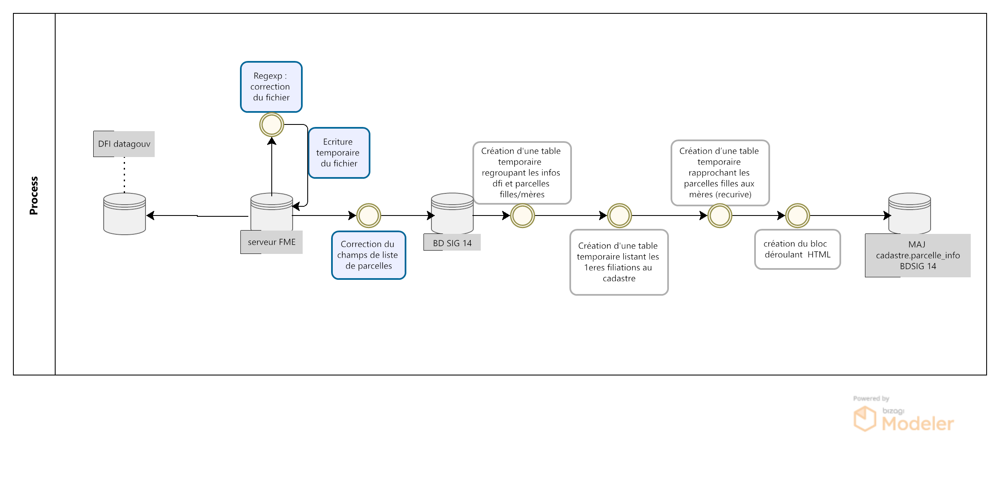
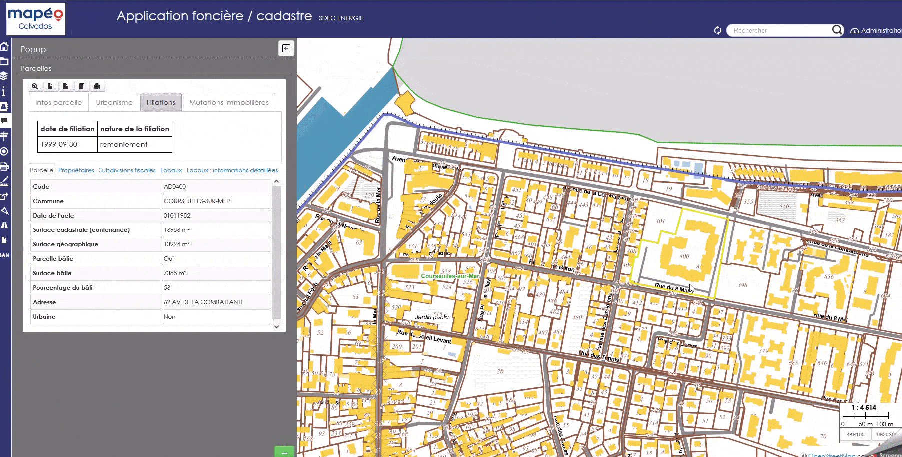
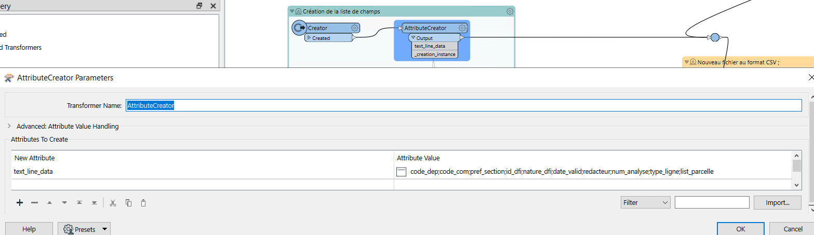
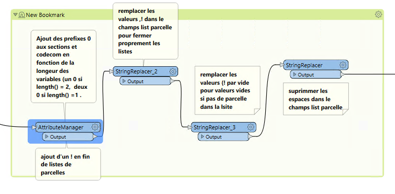

III- Onglet Filiation parcellaire 
*********************************

Les fichiers départementaux des documents de filiation informatisés (DFI) des parcelles permettent de consulter l'historique des parcelles cadastrales.

Ce fichier recense les modifications parcellaires réalisées depuis l'informatisation de leur procédure de mise à jour qui, selon les départements, est intervenue entre les années 1980 à 1990. L'origine des différentes mises à jour (documents d'arpentage, croquis de conservation, remaniement...) ainsi que leurs dates sont renseignées.

Ce fichier sont disponibles sur le site `datagouv.fr <https://www.data.gouv.fr/fr/datasets/documents-de-filiation-informatises-dfi-des-parcelles/>`_

Le fichier est au format txt. Le point-virgule est le caractère séparateur. La taille des champs est fixe.

Chaque lot d’analyse d’un même document de filiation fait l’objet de deux lignes successives :

* celle de type 1 pour toutes ses parcelles mères (il peut n’y en avoir aucune dans le cas d’extraction du domaine non cadastré) ;

* celle de type 2 pour toutes ses parcelles filles (il peut n’y en avoir aucune dans le cas de passage au domaine public).

A partir de ce fichier, le pôle SIG du Département du Calvados, propose de consulter la généalogie d'une parcelle.

1- Traitement et import FME des données 
=========================================

Le fichier DFI est difficilement exploitable en brut.

Le fichier sépare chaque valeur par un ; .

Le nombre de valeurs de parcelles est variable, ce qui implique un nombre de champ variable.

Le workbench FME se trouve `ici <https://github.com/sig14/sig14.github.io/releases/tag/FME_filiation_parcelles_dfi>`_

1.1 Regexp : correction du fichier
------------------------------------

Dans un premier temps, afin de pouvoir correcetement lire le fichier, les données parcelles sont réunies en listes dans un seul champs à l'aide d'expression régulière et de l'ETL FME.

140;001;000;0000299;1;19900305;XXXXXREDACTEURDUDOCUMENTXXXX;00001;2;A0297;A0298;

* Identifier les listes de parcelles après le 9e **;**
                 
              (?:[^\;]*\;){9}(.*)

match1 : **140;001;000;0000299;1;19900305;XXXXXREDACTEURDUDOCUMENTXXXX;00001;2;A0297;A0298;** 

group1 : **A0297;A0298;**

* Extraire le résultat du group1 dans un attribute creator

               **@Value(list_parcelles{0}.part)**

* Supprimer les valeurs du group du premier match 

match1 : **140;001;000;0000299;1;19900305;XXXXXREDACTEURDUDOCUMENTXXXX;00001;2** 

* Remplacer les **;** du resultat de liste de parcelles extrait par des **,**

group1 : **A0297,A0298,**

* Concatener le match 1 et les résultas extraits

**140;001;000;0000299;1;19900305;XXXXXREDACTEURDUDOCUMENTXXXX;00001;2;A0297, A0298,**

* On ajoute ensuite une ligne avec la liste des nom de champs

1.2 Lecture du CSV
------------------

Après écriture du fichier, on lit le fichier CSV en exposant la liste des attributs souhaités.

.. image:: ../img/cadastre/24_expose_attribute.png
   :scale: 50

1.3 Remplacer : seconde correction du fichier
----------------------------------------------

On effectue une dernière correction du fichier avant intégration dans la base de données.

* Ajout des prefixes 0 aux sections et codecom en fonction de la longeur des variables (un 0 si length() = 2,  deux 0 si length() =1 .

* suprimmer les espaces dans le champ list parcelle

* suprimmer la dernière virgule en trop dans le champs list parcelle

2- Champ HTML historique déroulant 
==========================================

L'objectif est ici de pouvoir consulter l'historique des filiations à l'échelle de la parcelle.

L'utilisateur peut, en cliquant sur une parcelle, consulter la généalogie de sa parcelle, connaitre sa/ses parcelles méres (antérieur), ses parcelles soeurs (issues de la/des même(s) parcelle(s) mère(s)) et connaître la nature de la filiation.

Pour cela on utilise une fonction postgresql/gis pour alimenter la table parcelle_info du cadastre et une mise en forme du formulaire QGIS en HTML pour publication sur le portail cartographique Lizmap.

2.1 - Fonction postgresql/gis
-----------------------------

* On crée le champ contenant l'html des déroulants détaillant les filiations du plus récent au plus ancien

        .. code-block:: sql

            alter table cadastre.parcelle_info add column tab_filiation text;

On lance ensuite une fonction postgresql/gis dont le code SQL se trouve `ICI <https://github.com/sig14/sig14.github.io/blob/master/cadastre/sql/fonction_filiation_parcelles_cadastre.sql>`_

* Dans un premier temps, la fonction met en place une table temporaire (que l'on va indéxer) regroupant ligne par ligne les infos dfi, la nature détaillée des dfi, la liste des parcelles mères et la liste des parcelles filles associées (filiation)

        .. code-block:: sql

            create UNLOGGED TABLE temp_parcelles_dfi as
            SELECT 
            a.code_com AS code_com,
               a.pref_section AS pref_section,
               a.id_dfi,
               a.num_analyse,
               a.date_valid,
               case when
               a.nature_dfi = '1' then 'arpentage'
               when a.nature_dfi = '2' then 'croquis de conservation'
               when a.nature_dfi = '4' then 'remaniement'
               when a.nature_dfi = '5' then 'arpentage numerique'
                  when a.nature_dfi = '6' then 'lotissement numérique'
                  when a.nature_dfi = '7' then 'lotissement'
                        when a.nature_dfi = '8' then 'rénovation'end as nature_dfi,-- détail de la nature en fonction du code_nature
               a.list_parcelle AS parcelles_meres, -- liste des parcelles mères quand type_ligne = 1
               b.list_parcelle AS parcelles_filles --liste des parcelles filles associées aux parcelles mères quand type_ligne = 2 (jointure sur date, code com, section, id_dfi et numero d'analyse)
               FROM ref_foncier.parcelles_dfi a,
               ref_foncier.parcelles_dfi b
            WHERE a.type_ligne = '1'::text AND b.type_ligne = '2'::text AND concat(a.date_valid, a.code_com, a.pref_section, a.id_dfi, a.num_analyse) = concat(b.date_valid, b.code_com, b.pref_section, b.id_dfi, b.num_analyse);

* Création d'une table temporaire listant les premières filiations liées aux parcelles actuelles du cadastre

        .. code-block:: sql

            create UNLOGGED TABLE temp_parcelles_init as 
            with parcelle_init as (	-- liste des parcelles du cadastre qui sont comprises dans les parcelles filles dfi 
                     select a.code_com, a.date_valid, a.nature_dfi, a.pref_section, a.id_dfi, a.num_analyse, 
                  a.parcelles_meres, -- Conservation des parcelles mères dfi dont les filles comprennent une parcelle du cadastre
                  concat('{', b.ccosec, b.dnupla, '}')::text[] as parcelles_filles, -- Parcelle du cadastre associée aux parcelles filles dfi
                  replace(a.parcelles_filles::text,concat( b.ccosec, b.dnupla), '')  as parcelles_soeurs -- Supprimer (remplacer par '') la parcelle du cadastre associée de la liste des parcelles filles pour trouver les parcelles soeurs
                        from temp_parcelles_dfi a, cadastre.parcelle b
                        where  concat(b.ccosec, b.dnupla) = ANY(a.parcelles_filles::text[]) -- jointure sur les num parcelle et section cadastre dans les parcelles filles dfi
                        and a.code_com::text = b.ccocom -- et sur une même commune
                        and a.pref_section::text = translate(b.ccopre, ' ', '0')  ) -- et sur un même prefixe de séction
               
               select a.code_com, a.date_valid, a.nature_dfi, a.pref_section,  
               a.parcelles_meres::text[], a.parcelles_filles::text[] , replace(translate(parcelles_soeurs::text, '{}', ''), ',', ' ') as parcelles_soeurs, -- transformation en format liste des listes de parcelles
               1 as num_filiation, -- création d'un numéro de filiation
               concat(translate(a.parcelles_filles::text, '{}','') ) as id_filiation ---conserver le numéro de parcelle fille initial en format txt
               from parcelle_init a ; 

* Création d'une table temporaire rapprochant les parcelles filles aux listes de parcelles mères (récursive)

        .. code-block:: sql

                     CREATE UNLOGGED TABLE temp_parcelle_filiation as

               with recursive search_meres (code_com, date_valid, nature_dfi, pref_section,  parcelles_meres , parcelles_filles, parcelles_soeurs,  num_filiation, id_filiation)  as (-- paramètres récursive
                  
                     
               select a.* --selection des filiations initiales au cadastre
               from temp_parcelles_init a
               
                  UNION -- union pour la recursivité

                        select c.code_com,c.date_valid, c.nature_dfi, c.pref_section,    
                        c.parcelles_meres::text[], -- Conservation des parcelles mères dfi dont les filles comprennent d'autres parcelles filles dfi
                        array(select unnest(c.parcelles_filles::text[])
                        intersect 
                        select unnest( d.parcelles_meres::text[])) as parcelles_filles ,---- selectionner les parcelles filles dfi comprises dans les listes de parcelles mères initiales
                     
                        array(select unnest(c.parcelles_filles::text[])
                        except
                        select unnest( d.parcelles_meres::text[]))::text as parcelles_soeurs, ---- selectionner les parcelles filles dfi non comprises dans les listes de parcelles mères initiales pour trouver les parcelles soeurs
                        
                        d.num_filiation + 1 as num_filiation, -- ajout de 1 au numéro de filiation 
                        
                        d.id_filiation --- conserver le numéro de parcelle cadastre initial en txt

                        from temp_parcelles_dfi c, search_meres d
                        where d.parcelles_meres::text[]  @> c.parcelles_filles::text[] -- jointure des parcelles dfi aux parcelles initiales quand au moins une parcelle de la liste parcelle mère initiale est comprise dans la liste parcelle fille dfi
                        AND concat(d.code_com, d.pref_section) = concat(c.code_com, c.pref_section)), -- et sur le code commune et prefixe de section

            result as (select row_number() over() as fid, a.* from search_meres a ) --- selectionner le resultat de la recursive et ajouter un id unique

* ... Suite de la table : création du bloc déroulant HTML avec historique des filiations de parcelles dans un champ text avec num parcelle associé

        .. code-block:: sql

            select row_number() over() as id, --- creation du html
               concat(-- bloc html creant la table deroulante
               '<table class = "t2">
            <thead>
               <tr>
                  <th>date de filiation </th>
                  <th>nature de la filiation</th>
               </tr>
            </thead>
            <tbody>',

            string_agg(-- aggregation des infos  dfi filles, meres et soeurs : date, parcelles ordonnées par le numéro de filiation 
               ('<tr>
                  <td><label for="row'||fid || '"></label>' ||  date_valid::text::date || 
                  '</td>
                  <td>'|| nature_dfi || '</td>
               </tr><tr>
                  <td colspan="6">
                  <input id="row'||fid||'" type="checkbox">
                  <table>
                     <tr>
                        <th>Nouvelle(s) parcelle(s)</th>
                        <th>Parcelle(s) soeur(s)</th>
                        <td>Ancienne(s) parcelle(s)</td>
                  </tr>
                     <tr>
                        <th>'||translate(parcelles_filles::text, '{}', '')||'</th>
                        <th>'||translate(parcelles_soeurs::text, '{}', '')||'</th>
                        <td>'||translate(parcelles_meres::text, '{}', '')||'</td>
                     </tr>
                  </table>'
                  ) , '</td>
               </tr>'
                  order by num_filiation asc),'</tbody>
            </table>') as tab_filiation, concat('140',code_com, pref_section, id_filiation) as num_parcelle -- creation du num parcelle : cod dep + codcom + pref_section + num_parcelle cadastre initial
               from result a
               group by code_com, pref_section, id_filiation; -- grouper par parcelle, pref section et num parcelle cadastre initial

* Mise à jour des champs  HTML de la table parcelle_info grâce aux identifiants parcelles de la table précédement créée.

2.2 - Paramètrage Qgis/plugin Lizmap
------------------------------------

* Mise à jour de l'info bulle HTML dans les propriété de la couche QGIS

.. image:: ../img/cadastre/18_info_bulle_html.png
   :scale: 50

Le code HTML (Onglet Filiations + partie tab_filiation) se trouve `Par ici <https://github.com/sig14/sig14.github.io/blob/master/cadastre/html/popup_cadastre.html>`_

2.3 - Rendu lizmap
------------------

* Mise à jour du CSS dans le panneau de configuration Lizmap

Le code CSS se trouve `ici <https://github.com/sig14/sig14.github.io/blob/master/cadastre/css/dfi_cadastre>`_

.. image:: ../img/cadastre/19_config_css.png
   :scale: 50
