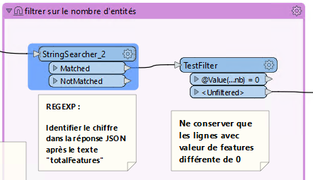
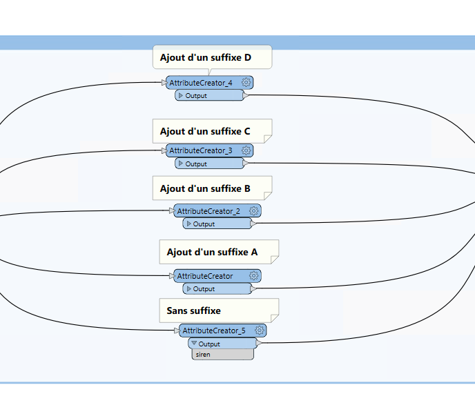

II- Onglet Documents d'urbanisme GPU
************************************

Le service d’interrogation du GPU permet d’obtenir les différentes informations d’urbanisme intersectant une géométrie (ponctuelle ou surfacique). Ces informations sont disponibles en consultation et en téléchargement sur le `Géoportail de l'urbanisme <https://www.geoportail-urbanisme.gouv.fr/>`_

Le dépratement met a disposition des communes l'ensemble de ces informations, ainsi que celles du cadastre sur son portail cartographique.
Afin de faciliter la lecture des informations, l'ensemble des données du GPU sont collectées dans la base de données du Département à chaque mise à jour sur le GPU par les colectivités et agglomérées à l'echelle de la parcelle.

.. image:: ../img/cadastre/7_schema_fiches_dosc_urba.png
   :scale: 50

Cela permet aux partenaires du CD14 de pouvoir consulter rapidement les informations du GPU liées à chaque parcelle : impact des zonages sur la parcelle, documents pdf associés, etc.

.. image:: ../img/cadastre/docs_urba.gif
   :scale: 50

1- Import FME des données GPU
===============================

L'import des données de l'API GPU se fait via le logiciel ETL FME.

Dans un premier les données GPU sont chargées dans la base de données du CD14 à l'échelle du Calvados.

Les données du GPU sont segementées par collectivité via un code partition formé : 

* du prefixe "DU _"
* du code insee commune ou siren epci (en fonction du type de document : carte communale, PLU, PLUI)
* D'un code optionnel de secteur pour les EPCI (A, B, C, D)

Pour le Calvados, les codes insee des communes correspondent aux codes insee des communes historique (avant loi NOTRE).

Pour finir, certaines communes sont soumises au RNU (Réglement National d'Urbanisme) et n'ont donc pas de documents d'urbanisme enregistrée sur le GPU.

1.1 - Zonages et cartes communales
-----------------------------------

Un premier projet FME récupère les données d'emprise de document ainsi que les zonages PLU et secteurs de cartes communales.

Le workbench FME chargeant les données depuis l'API, réalisant le traitement et l'intégration des données en base se trouve `par ici <file:////apw65/_FME/DOC_URBA/api_gpu2postgis/Calvados/1_api_zonage_gpu2postgis.fmw>`_

* Récupération des codes siren EPCI et ajout des potentiels suffixes (code optionnel secteur)

.. image:: ../img/cadastre/9_siren_epci_dosc_urba.png
   :scale: 50

* Récupération des codes insee des communes historiques

.. image:: ../img/cadastre/10_insee_communes_doc_urba.png
   :scale: 50

* Intérogation de l'API pour connaitre les communes au RNU ou non

On intérroge l'API avec les paramètres suivants :

URL : http://apicarto.ign.fr/api/gpu/municipality?insee=@Value(insee)

HTPP method : GET

response body : Attribute

.. image:: ../img/cadastre/11_api_rnu_doc_urba.png
   :scale: 50

* Filtrer les communes qui ne sont pas au RNU et stocker les valeurs (rnu = true/flase) dans une table à part (pour information)

.. image:: ../img/cadastre/12_filtre_rnu_doc_urba.png
   :scale: 50

* Récupération des données depuis l'API avec les "DU _" précédemments créés : données emprise, zonage et secteur carte communale

On intérroge l'API avec les paramètres suivants :

**emprise** :

URL : "https://apicarto.ign.fr/api/gpu/document?partition=DU_@Value(siren)"

HTPP method : GET

response body : Attribute

**zonage** :

Intérrogation de l'API avec les DU_partition précédemment créés

URL : "https://apicarto.ign.fr/api/gpu/zone-urba?partition=DU_@Value(siren)"

HTPP method : GET

response body : Attribute

**secteur carte communale** :

URL : "https://apicarto.ign.fr/api/gpu/secteur-cc?partition=DU_@Value(siren)"

HTPP method : GET

response body : Attribute

.. image:: ../img/cadastre/13_get_data_doc_urba.png
   :scale: 50

* Filtrer les données à partir de la réponse JSON : Expression régulière conservant le chiffre après 'totalFeatures' et conservation des lignes dont la valeur est différente de 0.

* Extraction des données du JSON : exposer les attributs et la géométrie

.. image:: ../img/cadastre/15_expose_attributes_doc_urba.png
   :scale: 50

* Retraitement des données : supression des prefixes de champs et reprojection de la géométrie (de 4326 à 2154)

.. image:: ../img/cadastre/16_reprojection_doc_urba.png
   :scale: 50

1.2 - Prescriptions
-------------------

Un second projet FME récupère les données de prescriptions linéaires, surfaciques et ponctuel sur le même modèle que précédemment, à l'exception de :

Le workbench FME se trouve `ICI <file:////apw65/_FME/DOC_URBA/api_gpu2postgis/Calvados/api_prescriptions_gpu2postgis.fmw>`_

* Récupération des codes insee des communes historiques qui ne sont pas classées au rnu depuis la table crée dans la partie précédente

.. image:: ../img/cadastre/17_rnu_doc_urba.png
   :scale: 50

* Récupération des données depuis l'API avec les "DU _" précédemments créés : données linéaires, surfaces et ponctuels

On intérroge l'API avec les paramètres suivants :

**surface** :

URL : "https://apicarto.ign.fr/api/gpu/info-surf?partition=DU_@Value(siren)"

HTPP method : GET

response body : Attribute

**linéaire** :

URL : "https://apicarto.ign.fr/api/gpu/info-lin?partition=DU_@Value(siren)"

HTPP method : GET

response body : Attribute

**ponctuel** :

URL : "https://apicarto.ign.fr/api/gpu/info-pct?partition=DU_@Value(siren)"

HTPP method : GET

response body : Attribute

1.3- Infos prescriptions
-------------------------

Un dernier projet FME récupère les données informations prescriptions linéaires, surfaciques et ponctuel sur le même modèle que précédemment.

Le workbench FME se trouve `à cet endroit <file:////apw65/_FME/DOC_URBA/api_gpu2postgis/Calvados/api_info_prescriptions_gpu2postgis.fmw>`_

* Récupération des données depuis l'API avec les "DU _" précédemments créés : données linéaires, surfaces et ponctuels

On intérroge l'API avec les paramètres suivants :

**surfaces** :

URL : "https://apicarto.ign.fr/api/gpu/info-surf?partition=DU_@Value(siren)"

HTPP method : GET

response body : Attribute

**linéaires** :

URL : "https://apicarto.ign.fr/api/gpu/info-lin?partition=DU_@Value(siren)"

HTPP method : GET

response body : Attribute

**ponctuels** :

URL : "https://apicarto.ign.fr/api/gpu/info-pct?partition=DU_@Value(siren)"

HTPP method : GET

response body : Attribute

2- Champ HTML GPU par parcelle du cadastre
==========================================

L'objectif est ici de pouvoir consulter les données du GPU à l'échelle de la parcelle.

L'utilisateur peut en cliquant sur une parcelle, consulter les données du GPU qui intersectent la parcelle, ouvrir les documents pdf associés sur le portail du GPU et connaitre l'impact des réglements sur la parcelle.

Pour cela on utilise une fonction postgresql/gis pour alimenter la table parcelle_info du cadastre et une mise en forme du formulaire QGIS en HTML pour publication sur le portail cartographique Lizmap.

2.1 - Fonction postgresql/gis
-----------------------------

* En premier lieu, on corrige les géométries invalides des données GPU intégrés à la base de données CD14

        .. code-block:: sql

                update ref_urbanisme.gpu_api_zonages set geom = ST_MakeValid(geom);

                update ref_urbanisme.gpu_api_secteur_cc set geom = ST_MakeValid(geom);

                update ref_urbanisme.gpu_api_prescription_surf set geom = ST_MakeValid(geom);

                update ref_urbanisme.gpu_api_prescription_lin set geom = ST_MakeValid(geom);

                update ref_urbanisme.gpu_api_info_prescription_surf set geom = ST_MakeValid(geom);

                update ref_urbanisme.gpu_api_info_prescription_lin set geom = ST_MakeValid(geom);

* On Créé le champ contenant l'html de table contenant les informations GPU par parcelle

        .. code-block:: sql

                ALTER TABLE cadastre.parcelle_info
                ADD tab_doc_urba varchar;

* On créé ensuite les champs contenant l'html des déroulants détaillant les informations contenues dans le tableau

        .. code-block:: sql

                ALTER TABLE cadastre.parcelle_info
                ADD deroulant_zonage varchar;

                ALTER TABLE cadastre.parcelle_info
                ADD deroulant_secteur varchar;

                ALTER TABLE cadastre.parcelle_info
                ADD deroulant_prescription varchar;

                ALTER TABLE cadastre.parcelle_info
                ADD deroulant_info varchar;

On lance ensuite une fonction postgrresql/gis dont le code SQL se trouve `Par <file://K:/Pole_SIG/Interne/03_TRAITEMENTS_SIG/1_postgres/doc_urba/fiche_parcelle_doc_urba.sql>`_

* Dans un premier temps, la fonction met en place des tables temporaires rapprochant les parcelles du cadastre avec les données du GPU. L'objectif est également de pouvoir indexer ces tables temporaires pour accélerer la suite des traitements.

*exemple de rapprochement des zonages PLU*

         .. code-block:: sql

                  CREATE UNLOGGED TABLE temp_parcelle_zonage_ref_urbanisme as 
                     select  p.geo_parcelle, z.*
                     FROM cadastre.parcelle_info p
                     inner join ref_urbanisme.gpu_api_zonages z 
                     on  st_intersects(p.geom, z.geom) and p.geom&&z.geom;

                  -- Indexation de la table temporaire    
                        CREATE INDEX index_temp_parcelle_zonage_ref_urbanisme ON temp_parcelle_zonage_ref_urbanisme USING btree (geo_parcelle);
                        CREATE INDEX index2_temp_parcelle_zonage_ref_urbanisme ON temp_parcelle_zonage_ref_urbanisme USING btree (id);

                  CREATE INDEX index_geom_temp_parcelle_zonage_ref_urbanisme
                  ON temp_parcelle_zonage_ref_urbanisme USING gist (geom);

* Dans un second temps, on réalise l'union des tables temporaires, on calcul l'impact des zonages GPU par parcelle (par intersection) ainsi que la surface totale de chaque zonage. 

*exemple d'UNION des zonages PLU et secteurs cartes communales*

         .. code-block:: sql

                  with parcelle_ref_urbanisme as (
                     --- selection des infos parcelles et zonages + impact zonage sur parcelle (intersection) + surface zonage total en metres carré
                     (select p.geo_parcelle,z.partition, z.nomfic,z.datappro::date, z.destdomi, z.datvalid::date, concat(round(st_area(z.geom)::numeric, 2)::text, ' m²') as surface, 'Zonages' as type_doc, z.libelle as nom, st_area(ST_CollectionExtract(st_intersection(p.geom, z.geom),3)) as impact,
                              
                              'surf' as impact_txt,
                              z.libelong as commentaire, st_area(p.geom) as area_parcelle 
                     FROM cadastre.parcelle_info p
                     join temp_parcelle_zonage_ref_urbanisme  z 
                     on  z.geo_parcelle = p.geo_parcelle
                     )
                     UNION
                     --- selection des infos parcelles et secteurs cartes communales + impact secteur sur parcelle (intersection) + surface secteure total en metres carré
                     (select p.geo_parcelle,z.partition, z.nomfic,z.datappro::date, z.destdomi, z.datvalid::date, concat(round(st_area(z.geom)::numeric, 2)::text, ' m²')  as surface, 'Secteurs' as type_doc, z.libelle as nom, st_area(ST_CollectionExtract(st_intersection(p.geom, z.geom),3)) as impact,
                                          'surf' as impact_txt,
                              z.libelong as commentaire, st_area(p.geom) as area_parcelle 
                     FROM cadastre.parcelle_info p
                     join temp_parcelle_secteurs_ref_urbanisme z 
                     on   z.geo_parcelle = p.geo_parcelle
                     )

* On ne conserve que les entités dont l'impact sur la parcelle est supérieure à 1 ou qui sont des ponctuels et on construit les liens html pour consultation des documents pdf sur le GPU (concatenation de blocs html + num partition + clé dossier pdf emprise + nom de fichier)

         .. code-block:: sql
            
                  select geo_parcelle as parcelle, type_doc, destdomi, nom, datappro, datvalid, surface, impact,
                  case when impact_txt = 'surf' then 
                              concat(round(impact::numeric, 2)::text, ' m²')
                              when impact_txt = 'lin' then
                              concat(impact::text, 'm')
                              else impact_txt end -- creation de l'impact en text avec suffixe m² si surf, m si lineaire, sinon pas de suffixe
                              as impact_text ,
                  case when parcelle_ref_urbanisme.nomfic is not null  then concat('<a href="', 'https://wxs-gpu.mongeoportail.ign.fr/externe/documents/',parcelle_ref_urbanisme.partition,'/',
                  b.id,'/', parcelle_ref_urbanisme.nomfic, '" target="_blank">Règlement</a>') else 'no data' end as reglement, 

                  commentaire, round(impact*100/area_parcelle) as taux_inclusion -- création taux d'inclusion : pourcentage de l'impact sur la surface de la parcelle
                  from parcelle_ref_urbanisme
                  left join ref_urbanisme.gpu_api_emprise b on parcelle_ref_urbanisme.partition = b.partition -- jointure  de l'emprise pour selection de la clé dossier pdf
                  where  (parcelle_ref_urbanisme.impact >= 1 or parcelle_ref_urbanisme.impact_txt ='ponctuel')
                  order by geo_parcelle, type_doc DESC, nom ASC

* On construit ensuite les déroulants de détail en html(en accordéon) : concatenation de blocs html et des champs d'informations. On concatène seulement les valeurs non nulles.

*exemple de création de déroulant accordéon zonage PLU*

         .. code-block:: sql

               select a.parcelle, -- création d'un déroulant "accordion html" zonage pour détail du zonage par parcelle
                     string_agg( 
                                 (' 

 Zone '||coalesce(a.nom, null, '')||'
<b>DestDomi</b>      '||coalesce(a.destdomi,null, '')||' <b>Description</b>     '||coalesce(a.commentaire,null, '')||'  <b>Approbation</b>     '||coalesce(a.datappro::text,null, '')||'  <b>Validité</b>     '||coalesce(a.datvalid::text,null, '')||'  <b>Surface </b>     '||coalesce(a.surface::text,null, '')||' 
'), '' 
                     order by a.type_doc DESC, a.nom ASC) as deroulant_zonage -- ordonne par type de document descendant et par nom de document acsendant
                           from pre_fiche a
                           where a.type_doc = 'Zonages'
                           group by a.parcelle

* creation du tableau HTML principal détaillant le zonage ou carte communale, les prescriptions et les infos prescriptions et ajout des déroulants de détails précédemment crééS

         .. code-block:: sql

               select a.geo_parcelle::varchar as parcelle, concat(-- creation du tableau HTML principal détaillant le zonage ou carte communale, les prescriptions et les infos prescriptions
                     '<table class = "t1" > 
               <tr>
                  <th> Types </th>
                  <th> Nom </th>
                  <th> Règlement </th>
                  <th> Impact </th>
                  <th> Commentaire </th>
                  <th> Taux d''inclusion </th>
               </tr>
               <tr>', string_agg( -- concatenation bloc html + aggregation des champs d'informations 
                  ('<td> '  ||coalesce(b.type_doc,null, '')||  '  </td><td> ' ||coalesce(b.nom,null, '')|| '  </td><td> ' ||coalesce(b.reglement,null, '')|| '  </td><td>  ' ||coalesce(impact_text,null, '')|| '  </td><td>  '||coalesce(b.commentaire,null, '')||'  </td><td>  ' ||coalesce(b.taux_inclusion::text,null, '')||  '  </td>' ),'</tr>
                     <tr>'order by b.type_doc DESC, b.nom ASC), -- ordonne par type de document descendant et par nom de document acsendant
                     '</tr>
                     </table>')::varchar as tab_doc_urba, deroulant_zonages.deroulant_zonage::varchar ,deroulant_secteurs.deroulant_secteur::varchar, -- ajout des champs html déroulants
                        deroulant_prescriptions.deroulant_prescription::varchar, deroulant_infos.deroulant_info::varchar,
               a.geom
               from
               cadastre.parcelle_info a
               left join pre_fiche b on b.parcelle = a.geo_parcelle
               left join deroulant_zonages on deroulant_zonages.parcelle = a.geo_parcelle
               left join deroulant_secteurs on deroulant_secteurs.parcelle = a.geo_parcelle
               left join deroulant_prescriptions on deroulant_prescriptions.parcelle = a.geo_parcelle
               left join deroulant_infos on deroulant_infos.parcelle = a.geo_parcelle
               group by a.geo_parcelle, a.geom, deroulant_zonages.deroulant_zonage,deroulant_secteurs.deroulant_secteur,
               deroulant_prescriptions.deroulant_prescription, deroulant_infos.deroulant_info;

* création d'un index sur la table temporaire et update des champs html de la table parcelle info 

*exemple de mise à jour du champs tableau html*

         .. code-block:: sql

               update cadastre.parcelle_info set tab_doc_urba = z.tab_doc_urba from temp_fiche z where z.parcelle = parcelle_info.geo_parcelle;

2.2 - Paramètrage Qgis/plugin Lizmap
------------------------------------

* Mise à jour de l'info bulle HTML dans les propriété de la couche QGIS

.. image:: ../img/cadastre/18_info_bulle_html.png
   :scale: 50

Le code HTML (Onglet Urbanisme + parties tab_doc_urba + deroulant : secteurs, zonages, prescriptions, info) se trouve `là <file://K:/Pole_SIG/Interne/03_TRAITEMENTS_SIG/9_lizmap/html/popup_cadastre.html>`_

2.3 - Rendu lizmap
------------------

* Mise à jour du CSS dans le panneau de configuration Lizmap

Le code CSS se trouve `à ce lien <file://K:/Pole_SIG/Interne/03_TRAITEMENTS_SIG/9_lizmap/css/style_docs_urba_cadastre.css>`_

.. image:: ../img/cadastre/19_config_css.png
   :scale: 50

3- Mise à jour quotidienne des données
======================================

A chaque modification d'un document ou ajout par une collectivité sur le GPU, le pôle SIG du Département met à jour les données issues du GPU dans la base de donnée CD14 et met éhalement à jour les fiches HTML de la table patrcelle info du cadastre.

3.1 - Mailing auto
-----------------------------

Le Géoportail de l'Urbanisme met à disposition un flux ATOM permettant de connaitre les dernières mises à jour de documents sur le GPU.

La documentation suivante décrit comment exploiter ce flux : `<https://www.geoportail-urbanisme.gouv.fr/image/UtilisationATOM_GPU_1-0.pdf>`_

Le pôle SIG utilise un site dédié qui exploite ce flux afin d'envoyer un mail à l'équipe SIG à chaque ajout d'une commmune du Département du calvados.

A la récéption de ce mail, un membre de l'équipe déclenche un fichier batch, permettant d'indiquer le numéro de partition et lançant 3 workbench FME de supresssion, d'intégration des données GPU dans la BD CD14 et de mise à jour des champs HTML des parcelles du cadastre.

            .. code-block:: batch

               set /p siren= " Saisir l'INSEE de la commune ou le Siren de l'EPCI entre guillemets "

               D:/apps/FME2022/fme.exe "D:/_FME/DOC_URBA/api_gpu2postgis/Commune_epci/1_DROP_DATA.fmw" --siren %siren%

               D:/apps/FME2022/fme.exe "D:/_FME/DOC_URBA/api_gpu2postgis/Commune_epci/2_INSERT_DATA.fmw" --siren %siren% 

               D:/apps/FME2022/fme.exe "D:/_FME/DOC_URBA/api_gpu2postgis/Commune_epci/3_FICHE_DOC_URBA_CADASTRE.fmw" --siren %siren% 

               pause

Le fichier batch est ` déposé ici <file:////apw65/_FME/DOC_URBA/api_gpu2postgis/insertion_new_com_epci.bat>`_

3.2 - FME :Import de l'emprise et supression des données
---------------------------------------------------------

Le premier worbench FME supprime les données GPU de la base sur le périmtre des nouvelles données importées.

Le workbench FME se `télécharge ici <file:////apw65/_FME/DOC_URBA/api_gpu2postgis/Commune_epci/1_DROP_DATA.fmw>`_

* Récupération du code siren EPCI ou insee commune entré dans le batch et ajout des potentiels suffixes (code optionnel secteur)

* Interrogation de l'API avec code partition pour récupérer l'emprise

.. image:: ../img/cadastre/21_emprise_maj_.png
   :scale: 50

*Paramètres interrogation API* :

Intérrogation de l'API avec les DU_partition précédemment créés

URL : https://apicarto.ign.fr/api/gpu/document?partition=DU_@Value(siren)

HTPP method : GET

response body : Attribute

* Interrogation de l'API avec code partition pour récupérer l'emprise

.. image:: ../img/cadastre/21_emprise_maj_.png
   :scale: 50

* Filtrer les données à partir de la réponse JSON : Expression régulière conservant le chiffre après 'totalFeatures' et conservation des lignes dont la valeur est différente de 0.

* Extraction des données du JSON : exposer les attributs et la géométrie

.. image:: ../img/cadastre/15_expose_attributes_doc_urba.png
   :scale: 50

* Retraitement des données : supression des prefixes de champs et reprojection de la géométrie (de 4326 à 2154)

.. image:: ../img/cadastre/16_reprojection_doc_urba.png
   :scale: 50

* Insertion des données dans la table historique import données et lancemnt d'une requête SQL suprimant les données GPU dont le "DU _" ets égal au "DU _" de leur emprise intersectent le centroid de la nouvelle emprise

.. image:: ../img/cadastre/22_supression_partition_.png
   :scale: 50

*Exemple SQL de supression de zonages PLU*

         .. code-block:: sql

               delete 
               from ref_urbanisme.gpu_api_zonages g 
               where g.partition =  (
                  select b.partition 
                  from ref_urbanisme.historique_imports_du a
                  left join ref_urbanisme.gpu_api_emprise b on st_intersects(b.geom, st_pointonsurface(a.geom))
               where a.date_import = now()::date and a.partition like 'DU_$(siren)%'
               group by b.partition);

3.3 - FME : Import des données en fonction de l'emprise
-------------------------------------------------------

Le second worbench FME insert les nouvelles données GPU au niveau du code partition "DU _" entré dans le batch sur le modèle décrit dans la partie 1.

Le workbench FME se  `trouve ici <file:////apw65/_FME/DOC_URBA/api_gpu2postgis/Commune_epci/2_INSERT_DATA.fmw>`_

3.4 - FME/PostgreSQL,GIS : Mise à jour des champs html GPU du cadastre
----------------------------------------------------------------------

Le dernier worbench FME lance une fonction méttant les champs HTML du cadastre au niveau du nouveau "DU _ partition" éntré dans le batch.

Le workbench FME  `se télécharge ici <file:////apw65/_FME/DOC_URBA/api_gpu2postgis/Commune_epci/3_FICHE_DOC_URBA_CADASTRE.fmw">`_

Ce workbench fonctionne comme le premier workbench récupérant l'emprise, mais avec une dernière requête qui corrige les géométries invalides des documents GPU et qui lance une fonction postgresql de mise à jour des champs HTML de la table parcelle_info du cadastre.

         .. code-block:: sql

               update ref_urbanisme.gpu_api_zonages set geom = ST_MakeValid(geom) where gpu_api_zonages.partition = @Value(partition);

               update ref_urbanisme.gpu_api_secteur_cc set geom = ST_MakeValid(geom) where gpu_api_secteur_cc.partition = @Value(partition);

               update ref_urbanisme.gpu_api_prescription_surf set geom = ST_MakeValid(geom) where gpu_api_prescription_surf.partition = @Value(partition);

               update ref_urbanisme.gpu_api_prescription_lin set geom = ST_MakeValid(geom) where gpu_api_prescription_lin.partition = @Value(partition);

               update ref_urbanisme.gpu_api_info_prescription_surf set geom = ST_MakeValid(geom) where gpu_api_info_prescription_surf.partition = @Value(partition);
               update ref_urbanisme.gpu_api_info_prescription_lin set geom = ST_MakeValid(geom) where gpu_api_info_prescription_lin.partition = @Value(partition);

               select ref_urbanisme.fiches_parcelles_lizmap(@Value(partition));

Cette dernière fonction fonctionne comme décrit en partie 2, mais uniquement pour les parcelles concernées par les nouveaux documents insérés (au niveau du nouveau "DU _" ).
