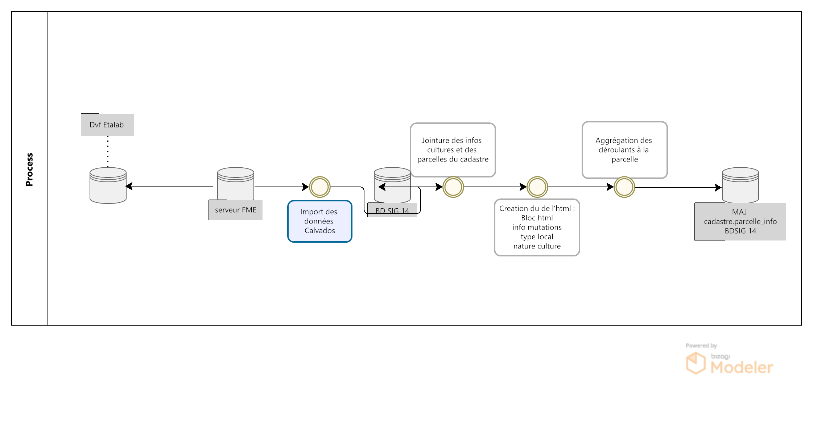

IV- Onglet Mutations immobilières
*********************************

Le jeu de données « Demandes de valeurs foncières », publié et produit par la direction générale des finances publiques, permet de connaître les transactions immobilières intervenues au cours des cinq dernières années. Les données contenues sont issues des actes notariés et des informations cadastrales.

Il es disponible sur le site `datagouv.fr <https://www.data.gouv.fr/fr/datasets/5c4ae55a634f4117716d5656/>`_

Les fichiers correspondant chacun à un millésime sont mis à disposition au format.txt. sur cinq ans.

Les fichiers mis à disposition font l’objet d’une mise à jour **semestrielle, en avril et en octobre**.

A partir de ce fichier, le pôle SIG du Département du Calvados, propose de consulter l'historique des mutations immobilières et leurs valeures foncières à l'échelle d'une parcelle.

.. image:: ../img/cadastre/mutation_immo.gif
   :scale: 50

1- Traitement et import FME des données 
=========================================

Un workbench FME récupère les données de valeurs foncières et les intègre dans la base de données du CD14.

Le workbench FME se trouve `ici <file:////apw65/_FME/CADASTRE/valeur_fonciere_txt2postgres.fmw>`_

2- Champ HTML historique déroulant 
==========================================

L'objectif est ici de pouvoir consulter l'historique des mutations immobilières et les valeurs foncières à l'échelle de la parcelle.

L'utilisateur peut en cliquant sur une parcelle, consulter les différentes mutations immobilières opérées sur la parcelle ces 5 dernières années.

Pour cela on utilise une fonction postgresql/gis pour alimenter la table parcelle_info du cadastre et une mise en forme du formulaire QGIS en HTML pour publication sur le portail cartographique Lizmap.

2.1 - Fonction postgresql/gis
-----------------------------

* On créé le champ contenant l'html des déroulants détaillant les filiations du plus récent au plus ancien

        .. code-block:: sql

            ALTER TABLE cadastre.parcelle_info
            ADD column deroulant_dvf varchar;

On lance ensuite une fonction postgrresql/gis dont le code SQL se trouve `ici <file://K:/Pole_SIG/Interne/03_TRAITEMENTS_SIG/1_postgres/foncier/dvf/fonction_dvf.sql>`_

* Dans un premier temps, on séléctionne des valeurs de champs distincts pour éviter les doublons

        .. code-block:: sql

            select  distinct on (
                        a.code_ch,
                        a.ref_doct,
                        a.no_disposition,...

* On joint les natures de cultures et cultures spéciales (créer une table à partir de la notice descriptive disponible sur le site `datagouv.fr <https://www.data.gouv.fr/fr/datasets/5c4ae55a634f4117716d5656/>`_ , ainsi que les numéros de parcelles du cadastre.

        .. code-block:: sql

            row_number() over() as id, -- creation d'un id unique
               b.geo_parcelle, b.geom, date_mutation, nature_mutation, valeur_fonciere , concat(no_voie, ' ', type_de_voie,' ', a.voie,' ', code_postal) as adresse ,
               type_local, nb_piece_princ,  surf_reelle_bati, surf_terrain,
                  c.libelle as nature_culture, -- ajout de la nature culture 
                  d.libelle as nature_culture_speciale -- ajout de la nature culture spéciale 
            from cadastre.parcelle_info b --- jointure de la tbale parcelle_info 
            inner join  ref_foncier.valeurs_foncieres a
            on b.geo_parcelle = concat(concat(code_dep, '0'), code_com, pref_section, section, no_plan) 
            left join ref_foncier.valeurs_foncieres_cultures c on a.nature_culture = c.code 
            left join ref_foncier.valeurs_foncieres_cultures_speciales d on a.nature_culture_speciale = d.code)

* Creation du champ html : bloc html + info mutation, decomposition type local + nature culture

        .. code-block:: sql

               select a.geo_parcelle, a.date_mutation,
                     
                     concat(' 

', nature_mutation,' / ', coalesce(valeur_fonciere,null, 'xx'),' euros  ', 
                     date_mutation,' ',coalesce(a.adresse,null, ''), '
',
                     string_agg( ('  '|| case when a.type_local = 'Maison' then '     '||-- decompostion du type de local : ajout d'un lien vers image github associé selon le type
                     
                                 concat(a.type_local,'       ')
                                 ||case when (a.nb_piece_princ = '0' or a.nb_piece_princ is null) then ''
                                    else concat(a.nb_piece_princ::text, ' pièces      ') end ||
                                 case when (a.surf_reelle_bati = '0' or a.surf_reelle_bati is null) then '' else concat(a.surf_reelle_bati::text, 'm² ') end), '' order by date_mutation::date DESC
                                 ),--- ajout de la nature terrain si present : surface terrain avec image terrain associé , null si pas de valeur de surface
                           nullif(concat( '   Terrain ' , surf_terrain, ' m²  '),
                           '   Terrain  m²  '),
                           
                           nullif(translate(array_agg( DISTINCT nature_culture::text )::text, '{}', '' ), 'NULL'),' ' --- aggregation des natures de cultures, null si pas de valeur
                           , nullif(replace(translate(array_agg( DISTINCT nature_culture_speciale::text)::text, '{}', ''), 'NULL', ''), ''), '
'  --- aggregation des natures de cultures spéciales, null si pas de valeur
                           ) as deroulant_dvf
               from parcelles_dvf a
               group by a.geo_parcelle, a.date_mutation, valeur_fonciere, nature_mutation, adresse,surf_terrain

* Aggreger les déroulants par parcelle et les ordonner par date de mutation

        .. code-block:: sql

            select a.geo_parcelle, string_agg((deroulant_dvf), '' order by date_mutation::date DESC) as deroulant_dvf
            from group_parcelle a
            group by a.geo_parcelle;

* indexation de la tbale, vider et updater le champs deroulant html de cadastre.parcelle_info au niveau du numero de parcelle

        .. code-block:: sql
         
            CREATE INDEX index_temp_dvf  ON temp_dvf  USING btree (geo_parcelle);

            update cadastre.parcelle_info set deroulant_dvf = null;

            update cadastre.parcelle_info set deroulant_dvf = b.deroulant_dvf from temp_dvf b where b.geo_parcelle = parcelle_info.geo_parcelle;

   

2.2 - Paramètrage Qgis/plugin Lizmap
------------------------------------

* Mise à jour de l'info bulle HTML dans les propriété de la couche QGIS

.. image:: ../img/cadastre/18_info_bulle_html.png
   :scale: 50

Le code HTML (onglet mutation immobilière + partie deroulant_dvf) se trouve `ici <file://K:/Pole_SIG/Interne/03_TRAITEMENTS_SIG/9_lizmap/html/popup_cadastre.html>`_

2.3 - Rendu lizmap
------------------

* Mise à jour du CSS dans le panneau de configuration Lizmap

Le code CSS se trouve `ici <file://K:/Pole_SIG/Interne/03_TRAITEMENTS_SIG/9_lizmap/css/style_dvf_cadastre.css>`_

.. image:: ../img/cadastre/19_config_css.png
   :scale: 50
