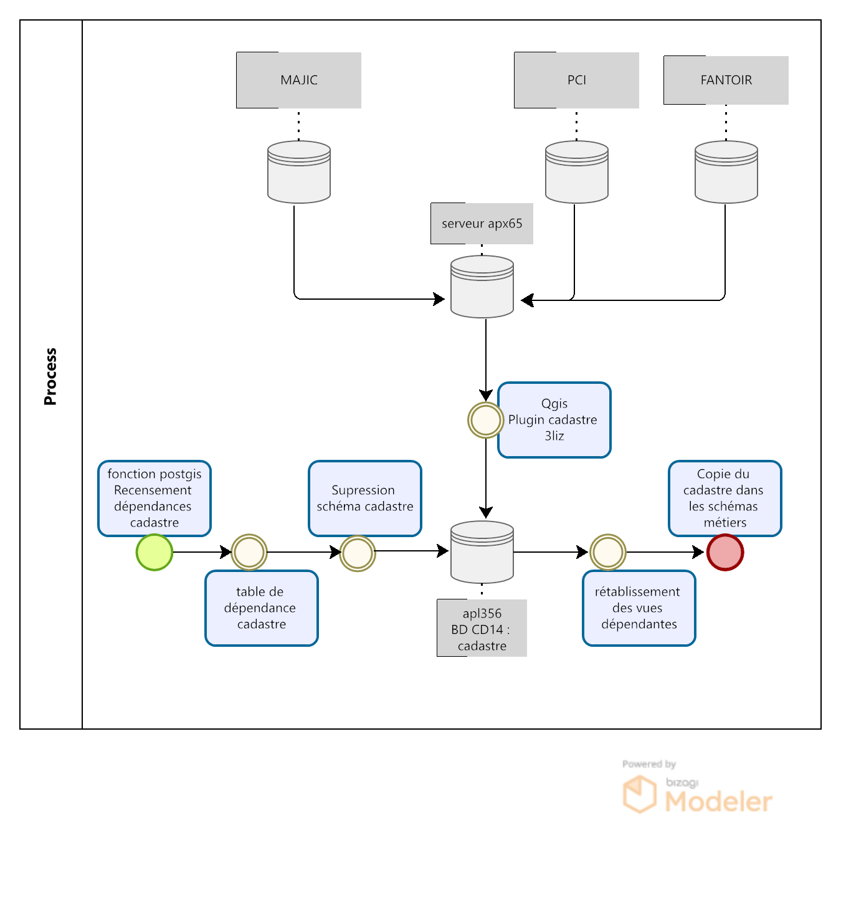
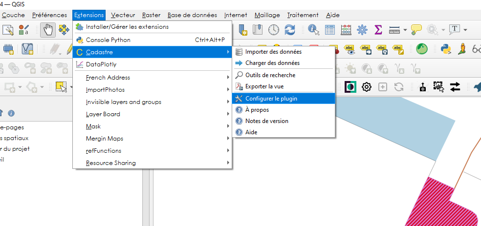

I- Mise à jour annuelle
******************************

1- Installation du plugin cadastre 
===================================

Télécharger la dernière version stable du plugin cadastre Qgis `ICI <https://github.com/3liz/QgisCadastrePlugin/releases>`_

Déziper-le et installer-le depuis le menu **extension** de QGIS.

.. image:: ../img/cadastre/1_plugin_cadaster.png
   :scale: 50

Une fois le plugin installé, un nouveau menu Cadastre apparaît dans le menu Extensions de QGIS. Il comporte les sous-menus suivants :

    * Importer des données
    * Charger des données
    * Outils de recherche
    * Exporter la vue
    * Configurer le plugin
    * À propos
    * Notes de version
    * Aide

2- Récupération des données cadastre
=====================================

**Plan Cadastral Informatisé (PCI)**

* Télécharger les données Millésime 1er au 1er janvier du PCI Vecteur au format EDIGEO :  `Site cadastre EDIGEO <https://cadastre.data.gouv.fr/datasets/plan-cadastral-informatise>`_

**Mise A Jour des Informations Cadastrales (MAJIC)**

* Transmission chaque année au CD14 (juillet/aout) des données MAJIC par la DDFIP. 
* Les données MAJIC transmises correspondent à un état des lieux à janvier de l'année courante.

**Fichier ANnuaire TOpographique Initialisé Réduit (FANTOIR)**
* Télécharger des données à l'échelle de la région Normandie :  `Site fantoir collectivites-locales.gouv.fr <https://www.collectivites-locales.gouv.fr/competences/la-mise-disposition-gratuite-du-fichier-des-voies-et-des-lieux-dits-fantoir>`_

3- Recenser les dépendances au schéma cadastre
================================================

La mise à jour des données cadastre dans la base de données postgresql nécessite de remplacer l'intégralité des tables de données, des vues et vues matérialisées qui en dépendent.

Il est donc nécéssaire de garder en mémoire les vues et vues matérialisées dépendantes du schéma afin de pouvoir les relancer après intégration des données cadastre.

Nous allons ainsi créer une table listant les vues et vm dépendantes du schéma cadastre et le code sql qui leur est associé.

Pour cela nous lançons la requête suivante :

      .. code-block:: sql

                drop table if exists public.dependances_v_vm_cadastre;
                create table  public.dependances_v_vm_cadastre as                       
                with a as 
                
                (WITH RECURSIVE s(start_schemaname, start_relname, start_relkind, relhasindex, schemaname, relname, relkind, reloid, owneroid, ownername, depth) AS (--recursive sur l'ensemble des données du schema cadastre 
                        SELECT n.nspname AS start_schemaname, -- nom du schema
                            c.relname AS start_relname, -- nom de la table
                            c.relkind AS start_relkind, 
                            c.relhasindex,
                            n2.nspname AS schemaname, -- nom du schema de la table dépendante
                            c2.relname, -- nom de la table dépendante
                            c2.relkind,
                            c2.oid AS reloid,
                            au.oid AS owneroid,
                            au.rolname AS ownername,
                            0 AS depth -- Commencer la dépendance à 0
                        FROM pg_class c
                            JOIN pg_namespace n ON c.relnamespace = n.oid AND (c.relkind = ANY (ARRAY['m', 'v','r','t','f', 'p'])) -- on commence par lister les tables, vues, vm dus chema cadastre
                            JOIN pg_depend d ON c.oid = d.refobjid
                            JOIN pg_rewrite r ON d.objid = r.oid
                            JOIN pg_class c2 ON r.ev_class = c2.oid
                            JOIN pg_namespace n2 ON n2.oid = c2.relnamespace
                            JOIN pg_authid au ON au.oid = c2.relowner
                    where n.nspname = 'cadastre' -- on limite le schema d'origine au cadastre
                        UNION -- union pour la récursivité
                        SELECT s_1.start_schemaname,
                            s_1.start_relname,
                            s_1.start_relkind,
                            s_1.relhasindex,
                            n.nspname AS schemaname,
                            c2.relname,
                            c2.relkind,
                            c2.oid,
                            au.oid AS owneroid,
                            au.rolname AS ownername,
                            s_1.depth + 1 AS depth -- on ajoute 1 pour chaque dépendance trouvée
                        FROM s s_1
                            JOIN pg_depend d ON s_1.reloid = d.refobjid
                            JOIN pg_rewrite r ON d.objid = r.oid
                            JOIN pg_class c2 ON r.ev_class = c2.oid AND (c2.relkind = ANY (ARRAY['m'::"char", 'v'::"char"])) --- on limite les dependances aux vues et vues materialisées
                            JOIN pg_namespace n ON n.oid = c2.relnamespace
                            JOIN pg_authid au ON au.oid = c2.relowner
                        WHERE s_1.reloid <> c2.oid --- on joint les dépendance au niveau de l'oid
                        )
                SELECT -- lancement de la recursive
                    s.schemaname::varchar,
                    s.relname::varchar,
                    s.relkind,
                    sum(s.depth) as depth,
                    case when relkind = 'v' then 'VIEW' else 'MATERIALIZED VIEW' end as kind -- on précise les acronymes view et matview
                    FROM s
                        group by 
                    s.schemaname,
                    s.relname,
                    s.relkind,
                    s.depth
                    order by s.depth),

                z as (select a.*,
                case when a.relkind = 'm' then b.definition -- on ajoute les requêtes sql dans un champs
                ELSE c.view_definition end as query,
                i.indexdef as queryndex -- on ajoute les requêtes d'indexe dans un champs
                from a
                left join  pg_matviews b on b.schemaname = a.schemaname and b.matviewname = a.relname
                left join  information_schema.views c on c.table_schema = a.schemaname and c.table_name = a.relname
                left join  
                    pg_indexes i on a.schemaname = i.schemaname and i.tablename = a.relname 
                order by depth)
                
                
                select z.schemaname::varchar,
                    z.relname::varchar,
                    z.relkind,
                    z.kind,
                    sum(z.depth) as depth, --on somme les dépendances pour ordoner le futur rafraichissemnt en focntion du nume de dépendance
                    z.query, z.queryndex
                from z
                group by 
                    z.schemaname,
                    z.relname,
                    z.relkind,
                    z.kind,
                    z.query,
                z.queryndex
                order by depth;
                ;

Le code de la table se trouve `par ici <https://github.com/sig14/sig14.github.io/blob/master/cadastre/sql/_maj_view_annuelle.sql>`_

.. image:: ../img/cadastre/2_table_dependances_cadastre.png
   :scale: 50

4- Import des données cadastre
================================================

* Modifier le nom du schema cadastre en schéma cadastre2 sur pgadmin, afin, par sécurité, de conserver la précédente version du schéma cadastre.

* Paramètrer le plugin en sélectionnant *configuration*. Sélectionner les bons noms et types de fichiers.

.. image:: ../img/cadastre/4_conf_plugin_2.png
   :scale: 50

* Lancer l'import postgis avec les paramètres suivant : 

- Base de données : Postgis, lizmap
- Schémas : taper cadastre et créer
- Fichiers EDIGEO : charger le dossier déposé sur APW65
- scr source : 2154
- scr cible : 2154
- Fichiers MAJIC: charger le dossier déposé sur APW65
- Département  : 14
- Lot : "donner un nom pour l'import"

.. image:: ../img/cadastre/5_import_plugin.png
   :scale: 50

.. image:: ../img/cadastre/6_import_plugin_2.png
   :scale: 50

5- Relancer les vues et VM dépendantes du cadastre
===================================================

Pour relancer les vues et vm dépendantes, lancer la requête suivante :

      .. code-block:: sql

            select create_v_vm_cadastre()

Cette requête appelle la fonction dont le code se trouve `là <https://github.com/sig14/sig14.github.io/blob/master/cadastre/sql/refresh_dependances_vues_vm_cadastre.sql>`_

7- Actualiser les fiches HTML de la table parcelle_info
=========================================================

Des champs HTML ont été développés par l'équipe SIG du Département afin de renseigner des informations complémentaires à la parcelle : Règlementation GPU par parcelle, historique des filiations de parcelle, historique des mutations immobilières.

Le processus de construction des champs est décrit en partie II, III et IV.

A chaque réimport du cadastre il est nécessaire de recréer et mettre à jour ces champs.

7.1 - Documents d'urbanisme 
----------------------------

* Créer le champ contenant l'html de la table contenant les informations GPU par parcelle

        .. code-block:: sql

                ALTER TABLE cadastre.parcelle_info
                ADD tab_doc_urba varchar;

* Créer les champs contenant l'html des déroulants détaillant les informations contenues dans le tableau

        .. code-block:: sql

                ALTER TABLE cadastre.parcelle_info
                ADD deroulant_zonage varchar;

                ALTER TABLE cadastre.parcelle_info
                ADD deroulant_secteur varchar;

                ALTER TABLE cadastre.parcelle_info
                ADD deroulant_prescription varchar;

                ALTER TABLE cadastre.parcelle_info
                ADD deroulant_info varchar;

* Lancer la fonction mettant à jour les champs (1 heure environ)

        .. code-block:: sql

                select ref_urbanisme.fiches_parcelles_lizmap();

7.2 - Filiations parcellaires
------------------------------

* Créer les champs contenant l'html des déroulants détaillant l'historique de filiation par parcelle

        .. code-block:: sql

            alter table cadastre.parcelle_info add column tab_filiation text;

* Lancer la fonction mettant à jour les champs 

        .. code-block:: sql

            select ref_foncier.tab_filiation_lizmap()

7.3 - Mutations immobilières
------------------------------

* Créer les champs contenant l'html des déroulants détaillant les mutations immobilières

        .. code-block:: sql

            ALTER TABLE cadastre.parcelle_info add column deroulant_dvf varchar;

* Lancer la fonction mettant à jour les champs

        .. code-block:: sql

            select ref_foncier.parcelles_valeur_fonciere_lizmap()
