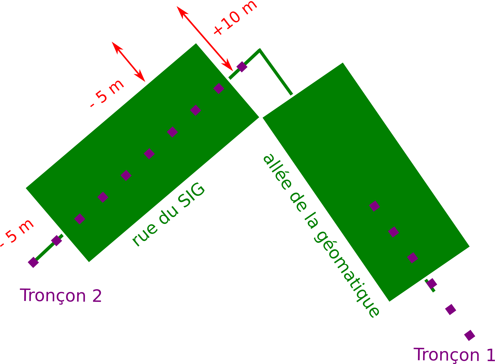
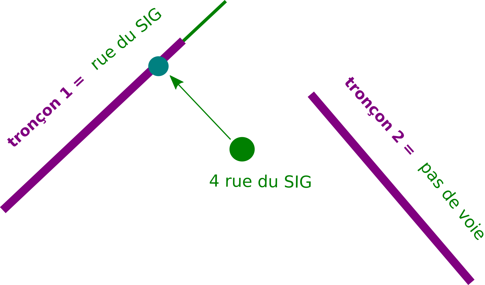
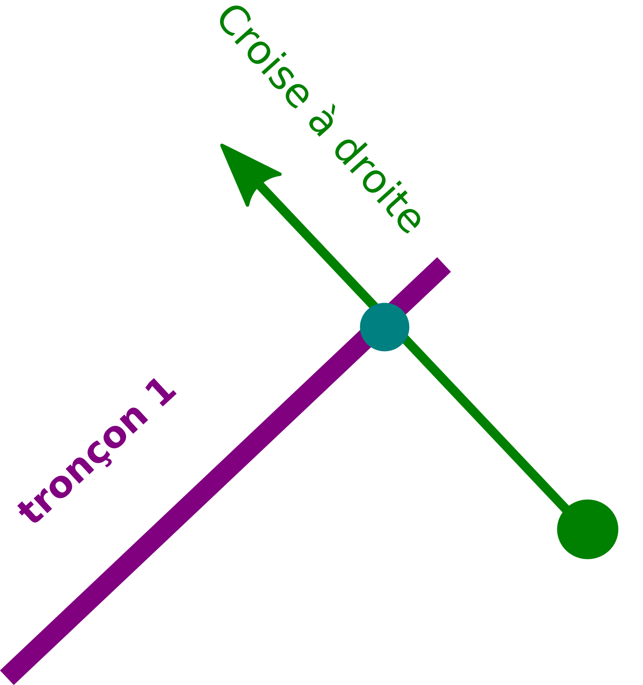

II- Rapprochement adresse BDtopo IGN
************************************

Afin de faciliter le travail d'intervention des secours, le pôle SIg à répondu à une demande de rapprochement des adresses BAL dont dispose le Département avec les tronçons de voies IGN.

L'objectif étant de déterminer pour chaque tronçon de BDtopo :
* Le  nom de la voie
* Le premier numéro à droite
* Le premier numéro à gauche
* Le dernier numéro à droite
* Le dernier numéro à gauche

.. image:: ../img/deci/schema_part_II.png
   :width: 580

1- Rapprochements des voies adresses avec les tronçons routes
=============================================================

Cette première étape vise à associer pour chaque voie tracée et enregistrée par les communes dans la base de données adresse du Département un tronçon BDtopo IGN.

Pour cela nous faisons appel à la fonction *adresse.id_voie_bdtopo_sdis()* qui se trouve ici : `fonction sql <https://github.com/sig14/sig14.github.io/blob/master/deci/sql/fonction_rapproche_adresses_voies_ign.sql>`_

1.1 Segmenter les tronçons Bdtopo
---------------------------------

Dans un premier temps, la fonction créé une table temporaire des noeuds de BDtopo que l'on va pouvoir indéxer pour accélerer le traitement :

         **1 - Séléction des périmètres communes bdtopo correspondant aux périmètres des communes adresses publiées** (pour circonscrire les tronçons sur les bons périmètres)

            .. code-block:: sql

                          with commune_pub as (
                           select st_buffer(bc.geom, 100) as geom from adresse.v_communes_publiees a, ign.bdtopo_commune bc -- buffer de 100 mètres des communes ign du au décalage ign osm
                                 where a.insee_code = bc.insee_com
                           ),   
                        troncon_com_pub as (--- selection des tronçon sur les communes bdtopo sléctionnées plus haut 
                           select b.* from ign.bdtopo_troncon_de_route b, commune_pub
                           where st_intersects(b.geom,commune_pub.geom)
                           ) 

         **2 - Création de noeuds bdtopo** : segemntation des tronçons tous les 10 mètres, transformation des segments en multipoints, dump pour avoir des géométries uniques.

         .. code-block:: sql

                    select ROW_NUMBER() OVER() as id_pt, c.id,  
                    (ST_Dump(ST_AsMultiPoint(st_segmentize(ST_Force2D(c.geom) ,10))::geometry(MULTIPOINT,2154))).geom as geom --- création de noeuds multipoints bdtopo à partir de la segmentisation des tronçons(3D)
                    from troncon_com_pub  c;

                    CREATE INDEX node_bd_topo_geom --- création d'un indexe sur la geom de la table
                    ON node_bd_topo USING gist (geom)
                    TABLESPACE pg_default;

1.2 Segmenter les tronçons Bdtopo
---------------------------------

Dans un second temps on rapproche les tronçon dont la majorité des noeuds se trouve sur une voie adresse.

         **1 - Buffer des voies adresses**

                  .. code-block:: sql

                           with commune_pub as ( ------ selection des communes bd_topo correspondant aux communes publiées adresse
                            select st_buffer(bc.geom, 100) as geom from adresse.v_communes_publiees a, ign.bdtopo_commune bc -- buffer de 100 mètres des communes ign du au décalage ign osm
					                  where a.insee_code = bc.insee_com
                            ),
                          voie as ( ------ selection des voies adresses bufferisées sur les communes publiées adresse
                            select v.id_voie, ST_Buffer(ST_Buffer(v.geom, 10, 'endcap=flat join=round'), -5, 'endcap=flat join=round') as geom -- on aura besoin du buffer pour collecter les noeuds (on créé un buffer de 10 mètres et on raccourci les bords de 5 mètres)
                            from adresse.voie v, commune_pub a
                            where st_intersects(a.geom,v.geom)
                            ),

         **2 - Compter le nombre de noeuds par tronçon de route**

                  .. code-block:: sql

                          pt_count_troncon as (------ Compte le nombre de noeuds par tronçon
                            select id, count(id_pt) as ct 
                            from node_bd_topo 
                            group by id),

         **4 - Rapprocher les noeuds bdtopo qui intersectent le buffer des voies adresses**

                  .. code-block:: sql

                          f as (------ rapprochement des id_voies et des noeuds à l'intérieur du buffer des voies précédemment créé
                            select b.id_pt, b.id, voie.id_voie 
                            from node_bd_topo  b
                            inner join voie
                            ON ST_Within(b.geom, voie.geom)
                            ),

         **5 - Compter le nombre de noeuds bdtopo par voie adresse**

                  .. code-block:: sql

                          l as ( ------ Compte le nombre de noeud pour chaque id_voie
                            select f.id, f.id_voie, count(f.id_voie) as ct 
                            from f
                            group by f.id, f.id_voie
                            ),

         **6 - Rapprochement des tronçons à une voie adresse si la majorité de ses noeuds sont compris dans son buffer** 

                  .. code-block:: sql

                          troncon_node as ( ------ Séléctionne les id_tronçon dont la majorité des noeuds intersecte le buffer des voies 
                            select distinct on (l.id) l.id, l.id_voie, l.ct 
                            from l , pt_count_troncon
                            where pt_count_troncon.id = l.id and (pt_count_troncon.ct/l.ct)<= 2 -- division du total des noeuds tronçon/le nombre de noeuds pour un même id_voie, si moins de 2, on conserve l'id-tronçon et l'id_voie associé
                            order by l.id, l.ct DESC)

                           select troncon_node.id, troncon_node.id_voie, k.geom ------ Rapprochement des géométrie de la bd_topo grâce à l'id tronçon des noeuds précédemment sélectionnés
                           from  troncon_node, ign.bdtopo_troncon_de_route k 
                           where k.id = troncon_node.id ;

2- Raprochement des adresses
============================

Cette seconde étape vise à associer pour chaque tronçon, les points adresses dépendant de la voie qui lui a été attribué.

Pour cela nous créons une vue materialisée *adresse.vm_sdis_pts_adresse_bdtopo* dont le code se trouve ici : `vm sql <https://github.com/sig14/sig14.github.io/blob/master/deci/sql/vm_rapproch_adresses_point_voie_ign.sql>`_

2.1 Projeter les points adresses sur les tronçons
-----------------------------------------------

On projete le point sur le tronçon le plus prohce associé à la voie dont dépend le point adresse.

         **1 - Projection des points adresse sur les tronçon ayant le même id_voie**

             .. code-block:: sql

               with bdtopo_idvoie as (
                     select * from  adresse.id_voie_bdtopo_sdis() --- Fonction donnant la séléction des id_tronçons bdtopo et des id_voies adresse
                  ),
                  distance_troncon as ( 
                     select p.id_point, troncon.id_troncon, troncon.id_voie, troncon.geom, p.numero, p.suffixe, p.geom as geom_pt_adresse,
                     ST_LineInterpolatePoint(ST_LineMerge(troncon.geom), ST_LineLocatePoint(ST_AsEWKT(ST_LineMerge(troncon.geom)), ST_AsEWKT(p.geom))) as geom_pt_proj, --- Projection des points adresses sur les tronçon ayant le même id_voie 
                     st_distance(troncon.geom, p.geom) as dist --- distance entre le point et la voie
                     FROM bdtopo_idvoie  troncon
                     inner join adresse.point_adresse p on troncon.id_voie = p.id_voie
                     inner join adresse.v_communes_publiees l  on st_intersects(p.geom,l.geom)
                  ),

         **2 - Séléction unique des id_points avec id tronçon associés dont la distance est la plus courte** : pour une voie comprenant plusieurs tronçons bdtopo on associe les points adresses aux tronçon le plus proche)

            .. code-block:: sql

               point_proj as( --- 
                  select distinct on (distance_troncon.id_point) distance_troncon.id_point, distance_troncon.id_troncon, distance_troncon.id_voie, -- selection distinct d'id_point adresse
                  distance_troncon.numero, distance_troncon.suffixe, distance_troncon.geom, geom_pt_adresse, geom_pt_proj
                  from distance_troncon
                  order by id_point, dist ASC --- ordonner de la plus petite distance à la plus grande pour que distinct sélectionne la première entité avec la plus courte distance
               ),

      

2.2 Determiné de quels côtés se trouve les point adresse
-----------------------------------------------------------

Pour identifier le côté du point adresse par rapport au tronçon.

         **1 - Tracer une ligne prolongées entre le point adresse et son point projeté sur le tronçon**

             .. code-block:: sql

                           line_cross as ( --- 
                  select point_proj.id_point, point_proj.id_troncon, point_proj.id_voie, point_proj.numero, point_proj.suffixe, point_proj.geom, geom_pt_adresse, geom_pt_proj, 
                  ST_MakeLine(geom_pt_adresse, ST_TRANSLATE(geom_pt_adresse, sin(ST_AZIMUTH(geom_pt_adresse,geom_pt_proj)) * (ST_DISTANCE(geom_pt_adresse,geom_pt_proj)
                  + (ST_DISTANCE(geom_pt_adresse,geom_pt_proj) * (50/49))), cos(ST_AZIMUTH(geom_pt_adresse,geom_pt_proj)) * (ST_DISTANCE(geom_pt_adresse,geom_pt_proj)
                  + (ST_DISTANCE(geom_pt_adresse,geom_pt_proj) * (50/49))))) as geom_segment
                  from point_proj
               ), 

         **2 - Definir le coté de du point adresse par rapport au tronçon grâce au sens de croisement du segment précédemment créé**

             .. code-block:: sql 

               point_cote as (--- 
                  select line_cross.id_point, line_cross.id_troncon, line_cross.id_voie, line_cross.numero, line_cross.suffixe,  
                  case WHEN ST_LineCrossingDirection(geom_segment, ST_LineMerge(geom)) = -1 then 'gauche'
                     WHEN ST_LineCrossingDirection(geom_segment, ST_LineMerge(geom) ) = 1 then 'droite'
                     WHEN ST_LineCrossingDirection(geom_segment, ST_LineMerge(geom) ) = 0 then 'indefini' --- Si croise ni à gauche ni à droite 
                     ELSE 'probleme' end as cote_voie,  --- croise plusieurs fois, donc problème de tracé du tronçon ou cas particulier (rare)
                  geom_segment, geom_pt_adresse, geom_pt_proj
                  from line_cross
               ),

2.3 Ne conserver que les premier et derniers points adresse
-------------------------------------------------------------

Pour identifier le côté du point adresse par rapport au tronçon.

         **1 - Séléction des tronçons sur les communes dont l'adressage est certifié/publié sur La BAN**

             .. code-block:: sql

                  commune_publ as (  ------ selection des communes bd_topo correspondant aux communes publiées adresse
                        select bc.geom from adresse.v_communes_publiees a, ign.bdtopo_commune bc
                           where a.insee_code = bc.insee_com
                     ),
                     troncon_com_pub as ( --- selection des tronçon sur les communes bdtopo sléctionnées plus haut
                        select b.* from ign.bdtopo_troncon_de_route b, commune_publ
                        where st_intersects(b.geom,commune_publ.geom)
                     ), 

         **2 - Séléction des points adresses droite/gauches les plus proches du point de fin et départ du tronçon**

            .. code-block:: sql

                     point_pair_first as ( ------ selection du point adresse par tronçon à droite le plus proche point de départ du tronçon
                        select distinct on (a.id_troncon) a.id_point, a.id_troncon, a.id_voie, a.numero, a.suffixe, a.cote_voie, a.geom_pt_adresse as geom_pt, 
                        st_distance(ST_StartPoint(st_linemerge(tc.geom)), a.geom_pt_proj) as dist
                        from point_cote a, troncon_com_pub tc
                        where cote_voie = 'droite' and a.id_troncon = tc.id
                        order by a.id_troncon, dist ASC --- ordonner de la plus petite distance à la plus grande pour que distinct sélectionne la première entité avec la plus courte distance
                     ),
                     point_pair_der as ( ------ selection du point adresse par tronçon à droite et le plus proche du point de fin du tronçon
                        select distinct on (b.id_troncon) b.id_point, b.id_troncon, b.id_voie, b.numero, b.suffixe, b.cote_voie, b.geom_pt_adresse as geom_pt, 
                        st_distance(ST_EndPoint(st_linemerge(tc.geom)), b.geom_pt_proj) as dist 
                        from point_cote b, troncon_com_pub tc
                        where cote_voie = 'droite' and b.id_troncon = tc.id
                        order by b.id_troncon, dist ASC
                     ),
                     point_impair_first as (------ selection du points adresse par tronçon à gauche et le plus proche du  point de départ du tronçon
                        select distinct on (c.id_troncon) c.id_point, c.id_troncon, c.id_voie, c.numero, c.suffixe, c.cote_voie, c.geom_pt_adresse as geom_pt,
                        st_distance(ST_StartPoint(st_linemerge(tc.geom)), c.geom_pt_proj) as dist
                        from point_cote c, troncon_com_pub tc
                        where cote_voie = 'gauche' and c.id_troncon = tc.id
                        order by c.id_troncon, dist ASC
                     ),
                     point_impair_der as (------ selection du point adresse par tronçon à gauche et le plus proche du  point de fin du tronçon
                        select distinct on (d.id_troncon) d.id_point, d.id_troncon, d.id_voie, d.numero, d.suffixe, d.cote_voie, d.geom_pt_adresse as geom_pt, 
                        st_distance(ST_EndPoint(st_linemerge(tc.geom)), d.geom_pt_proj) as dist
                        from point_cote d, troncon_com_pub tc
                        where cote_voie = 'gauche' and d.id_troncon = tc.id
                        order by d.id_troncon, dist ASC)

         **3 - Jointure des précdentes sélection :** tronçons rapproché (z),  geométrie tronçon ign (e) et  nom complet des voies(v)

            .. code-block:: sql

               Select z.id_troncon, z.id_voie, v.nom_complet, ------ J
               CONCAT(point_pair_first.numero,' ', point_pair_first.suffixe)  as prem_num_droite,
               CONCAT(point_pair_der.numero, ' ', point_pair_der.suffixe) as der_num_droite,
               CONCAT(point_impair_first.numero, ' ', point_impair_first.suffixe) as prem_num_gauche,
               CONCAT(point_impair_der.numero, ' ', point_impair_der.suffixe) as der_num_gauche,  
               e.geom as geom_tronçon
               from point_cote z 
               left join point_pair_first on z.id_troncon = point_pair_first.id_troncon
               left join point_pair_der on z.id_troncon = point_pair_der.id_troncon
               left join point_impair_first on z.id_troncon = point_impair_first.id_troncon
               left join point_impair_der on z.id_troncon = point_impair_der.id_troncon
               left join troncon_com_pub e on z.id_troncon = e.id
               left join adresse.voie v on v.id_voie = z.id_voie
               group by z.id_troncon, z.id_voie, point_pair_first.numero, point_pair_der.numero, point_impair_first.numero, point_impair_der.numero,
               point_pair_first.suffixe, point_pair_der.suffixe, point_impair_first.suffixe, point_impair_der.suffixe, e.geom, v.nom_complet  ;

.. image:: ../img/deci/II_2_3_start_point_end_point.png
   :width: 380      

3- Liste des points adresses indeterminés
=========================================

On identifie ici les points adresses dont le côté n'a pu être determiné : mauvais traçé d'un tronçon, positionnement particulier du point adresse par rapport au tronçon (à l'extrémité d'un tronçon).

Pour cela nous créons une vue materialisée *adresse.vm_sdis_pts_adresse_indetermine * dont le code se trouve ici : `vm sql <https://github.com/sig14/sig14.github.io/blob/master/deci/sql/vm_adresses_indeterminees_voies_ign.sql>`_

                   .. code-block:: sql

                        with bdtopo_idvoie as (--- Fonction donnant la séléction des id_tronçons bdtopo et des id_voies adresse
                        select * from  adresse.id_voie_bdtopo_sdis()
                        ),
                        commune_pub as (------ selection des communes bd_topo correspondant aux communes publiées adresse
                           select st_buffer(bc.geom, 100) as geom 
                           from adresse.v_communes_publiees a, ign.bdtopo_commune bc
                              where a.insee_code = bc.insee_com
                        ),
                        troncon_com_pub as (--- selection des tronçon sur les communes bdtopo sléctionnées plus haut
                           select b.* from ign.bdtopo_troncon_de_route b, commune_pub
                           where st_intersects(b.geom,commune_pub.geom)
                        )
                     select p.id, p.geom --- selection des tronçon qui n'ont pas d'id_voie associé
                     from troncon_com_pub p
                     left join bdtopo_idvoie a
                     on p.id = a.id_troncon
                     group by p.id, p.geom, a.id_voie
                     having a.id_voie is null

4- Voies adresses non affiliée à un tronçon 
==============================================

On identifie ici les voies adresses pour lesquelles aucun tronçon n'a pu être rapporché : pas de tronçon superposé, une trop petite partie du tronçon superposée.

Pour cela nous créons une vue materialisée *adresse.vm_troncon_no_voie_bd_topo* dont le code se trouve ici : `vm sql <https://github.com/sig14/sig14.github.io/blob/master/deci/sql/vm_voies_adresses_sans_tron%C3%A7on_ign.sql>`_

                  .. code-block:: sql

                     with bdtopo_idvoie as (--- Fonction donnant la séléction des id_tronçons bdtopo et des id_voies adresse
                     select * from  adresse.id_voie_bdtopo_sdis()
                     ),

                     distance_troncon as (--- Projection des points adresses sur les tronçon ayant le même id_voie et de la distance entre le point et la voie
                     select p.id_point, troncon.id_troncon, troncon.id_voie, troncon.geom, p.numero, p.suffixe, p.geom as geom_pt_adresse,
                     ST_LineInterpolatePoint(ST_LineMerge(troncon.geom), 
                     ST_LineLocatePoint(ST_AsEWKT(ST_LineMerge(troncon.geom)), ST_AsEWKT(p.geom))) as geom_pt_proj,
                     st_distance(troncon.geom, p.geom) as dist
                     FROM bdtopo_idvoie  troncon
                     inner join adresse.point_adresse p on troncon.id_voie = p.id_voie
                     inner join adresse.v_communes_publiees l  on st_intersects(p.geom,l.geom)
                     ),
                     point_proj as (--- Séléction des unique des id_points avec id tronçon associés dont la distance est la plus courte (une voie pouvant comprendre plusieurs tronçons bdtopo on associe les points adresses aux tronçon le plus proche)
                     select distinct on (distance_troncon.id_point) distance_troncon.id_point, distance_troncon.id_troncon, 
                     distance_troncon.id_voie, distance_troncon.numero, distance_troncon.suffixe, distance_troncon.geom, geom_pt_adresse, geom_pt_proj
                     from distance_troncon
                     order by id_point, dist ASC),
                     line_cross as ( --- tracer une ligne prolongées entre le point adresse et son point projeté sur le tronçon
                     select point_proj.id_point, point_proj.id_troncon, point_proj.id_voie, point_proj.numero, point_proj.suffixe, point_proj.geom, geom_pt_adresse, 				geom_pt_proj,
                     ST_MakeLine(geom_pt_adresse,  
                     ST_TRANSLATE(geom_pt_adresse, sin(ST_AZIMUTH(geom_pt_adresse,geom_pt_proj)) * (ST_DISTANCE(geom_pt_adresse,geom_pt_proj)
                     + (ST_DISTANCE(geom_pt_adresse,geom_pt_proj) * (50/49))), cos(ST_AZIMUTH(geom_pt_adresse,geom_pt_proj)) * (ST_DISTANCE(geom_pt_adresse,geom_pt_proj)
                     + (ST_DISTANCE(geom_pt_adresse,geom_pt_proj) * (50/49))))) as geom_segment
                     from point_proj ), 
                     point_cote as (--- Definir le coté de du point adresse par rapport au tronçon grâce à son sens de croisement du segment précédemment crée
                     select line_cross.id_point, line_cross.id_troncon, line_cross.id_voie, line_cross.numero, line_cross.suffixe,  
                     case WHEN ST_LineCrossingDirection(geom_segment, ST_LineMerge(geom)) = -1 then 'gauche'
                           WHEN ST_LineCrossingDirection(geom_segment, ST_LineMerge(geom) ) = 1 then 'droite'
                           WHEN ST_LineCrossingDirection(geom_segment, ST_LineMerge(geom) ) = 0 then 'indefini'
                           ELSE 'probleme' end as cote_voie, 
                     geom_segment, geom_pt_adresse, geom_pt_proj
                     from line_cross)
		     
 	              select * from point_cote  where cote_voie = 'indefini' or cote_voie ='probleme' ; --- Sélection des points adresses indéfinis ou à problème par rapport au tronçon de rattachement

