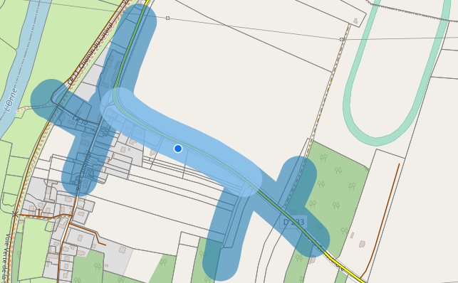
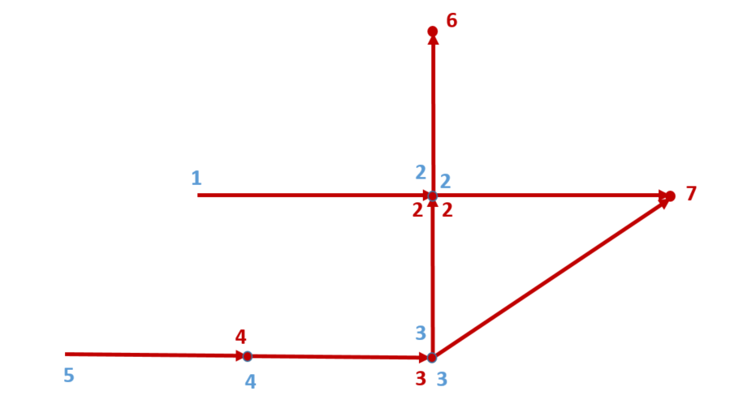
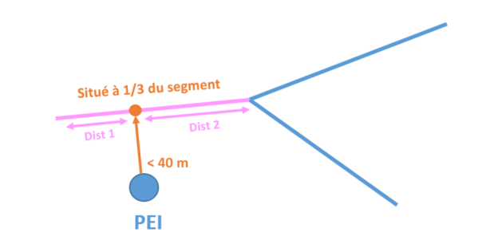
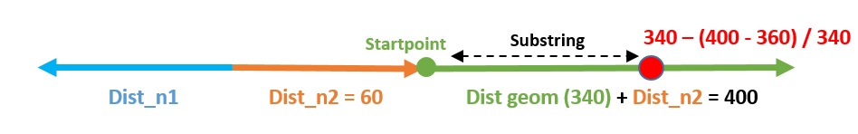
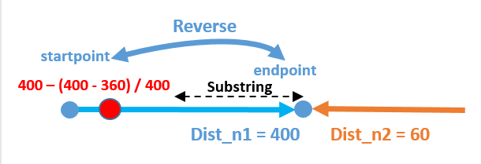

I- Périmètres des Bornes incendies
******************************

Dans le cadre du partenariat entre le CD14 et les Services Départementaux d'Incendie et de Secours (SDIS), une application a été dévellopée à destination des communes et partenaires afin de répertorier les points d'eau incendie (**PEI**) du Département.

La mise à disposition de ces sources d'eau relève de la responsabilité du maire.

Ainsi, où que les pompiers interviennent en zone habitée, ils devraient disposer d’un accès à l’eau à moins de **200 mètres** et d'une distance maximale de **400 mètres** entre les points d'eaux incendie.

Ainsi, une réfléxion a été menée pour calculer automatiquement ces 2 périmètres le long des routes à chaque création de borne incendie.

L'approche developpée consiste donc à éxploiter la localisation des **PEI**, créer des linéaires d'isodistances et les périmètres de **200** et **400** mètres via la route.

.. image:: ../img/deci/schema_part_I.png
   :width: 580

1- Référentiels de données
========================

1.1 BD Topo tronçons de routes
------------------------------

**Caractéristiques** :
*	Source : IGN
*	Réseau routier 
*	Format : vecteurs Multilinestring

1.2 Points Eau incendie DECI
------------------------------

**Caractéristiques** :
-	Source : SDIS
-	Poteaux ou des bouches d'incendie, raccordés au réseau d'eau potable
-	Format : vecteur point 

2- Création du linéaire routiers de référence
========================

La première étape consiste à créer une table miroir de données routes, en y indéxant les points de départ et d'arrrivée de chaque tronçon.

Le bornage de ces tronçon permettra par la suite de fixer le parcours de réseau et de mesurer les distances parcourues.

Le code sql de la fonction se trouve ici : `Fonction référentiel bornage routes DECI <https://github.com/sig14/sig14.github.io/blob/master/deci/sql/fonction_network_deci.sql>`_ 

2.1 Isoler les ségments de route
---------------------------------------------

Dumper la géométrie des routes pour obtenir les segments de routes.

      .. code-block:: sql
               
	               create table sdis.route_deci_segments as
	               select
	               row_number() over () as id,
	               a.id as oid,
	               dump.geom
	               from
	               sdis."2d_deci_bdtopo" a,
	               st_dump(geom) as dump
	 
	                ; 

2.2 Indéxer les startpoints des segments
---------------------------------------------

* On boucle sur les géométrie de segement pour alimenter un champs n1.

* On débute par la valeur 1 et on ajoute 1 à chaque nouvelle géometrie de startpoint dans une liste (indexe).

* On garde également en mémoire la géométrie dans une liste (points). 

* A chaque création d'entité, on vérifie la position du startpoint dans la liste (points).
  Si aucune position dans la liste on ajoute une valeur n1 (n+n1).
  Sinon, on donne la valeur de n de la liste (indexe) selon la postion du startpoint dans la liste (points) au champs n1.

         .. code-block:: sql
                        
                        for rec in select * from sdis.route_deci_segments loop
               -- Première extrémité
                        pt = st_startpoint(rec.geom);
               -- On cherche si ce point a déjà un numéro de noeud
                        pos := array_position(points, pt);
                        if pos is NULL then -- le point n'est pas encore indexé
               -- on crée un numéro et on l'insère
                              update sdis.route_deci_segments set n1 = n where id = rec.id;
                              points = array_append(points, pt);
                              indexe = array_append(indexe, n);
                              n := n + 1;
                         else
                -- on prend le numéro existant
                              pos := array_position(points, pt);
                              update sdis.route_deci_segments set n1 = indexe[pos] where id = rec.id;
                         end if;

.. image:: ../img/deci/1_start_point.png
   :width: 480

2.3 Indéxer les endpoints des segments
---------------------------------------------

* On applique la même méthode sur les endpoints

         .. code-block:: sql
                        
                       
		   -- Seconde extrémité
		         pt = st_endpoint(rec.geom);
		         pos := array_position(points, pt);
		   -- On cherche si ce point a déjà un numéro de noeud
		         if pos is NULL then -- le point n'est pas encore indexé
			-- on crée un numéro et on l'insère
			         update sdis.route_deci_segments set n2 = n where id = rec.id;
			         points = array_append(points, pt);
			         indexe = array_append(indexe, n);
			         n := n + 1;
		         else
			-- on prend le numéro existant
			         pos := array_position(points, pt);
			         update sdis.route_deci_segments set n2 = indexe[pos] where id = rec.id;
		         end if;
	         end loop;

3- Automatisation de la création des pèrimètres
================================================

La seconde étape consiste à la mise en place d'une fonction déclenchée par un trigger, pour calcul automatique des périmètres 200 et 400 mètres
à partir de la projection sur le référentiel routier du PEI nouvellement créé. 

Le code sql de la fonction se trouve ici : `Fonction calcul automatique perimètre PEI <https://github.com/sig14/sig14.github.io/blob/master/deci/sql/trigger_perimetre_bornes_incendie.sql>`_ 

3.1 Restreindre la zone de calcul
---------------------------------------------

Afin d'optimiser le temps de calcul, on selectionne uniquement les routes à 500 mètres du PEI créé.

            .. code-block:: sql
                                    
                                 
               CREATE UNLOGGED TABLE IF NOT EXISTS route_deci --- création d'une table temporaire qui sélectionne les segments_deci dans un buffer de 500 mètre autour du nouveau point créé
               as 
                  select r.* 
                  from sdis.route_deci_segments r
                  where st_intersects(r.geom, st_buffer(NEW.geom, 500, 'quad_segs=8')) ;

               CREATE  INDEX route_deci_idx ON route_deci (id);---création d'un indexe sur l'id de la table

3.2 Récursive : parcourir le linéaire à 400 mètres
--------------------------------------------------

Nous utilserons ici l'expression récursive de postgresql.

* On localise d'abords le segment le plus proche à moins de 40 mètres du nouveau PEI créé.
* On identifie la fraction du segment au niveau du point projeté (ST_LineLocatePoint)
* On calcul la longueur de la fraction du segment (longeur segment X fraction)

            .. code-block:: sql

                     select r.*, st_length(r.geom) * ST_LineLocatePoint(r.geom, st_closestpoint(r.geom, NEW.geom)) as longueur_depart, ---fraction de la longeur du segment de départ au niveau du point projeté sur le segment le plus proche
                     ST_LineLocatePoint(r.geom, st_closestpoint(r.geom, NEW.geom))  as fraction --- fraction du segment de départ au niveau du point projeté sur le segment le plus proche
                     from route_deci r
                     where st_intersects(st_buffer(r.geom, 40),NEW.geom) -- segment de départ à 40 mètre du point créé
                     order by st_distance (NEW.geom, r.geom) limit 1-- On garde seulement un segment (le plus proche)

* On créé ensuite les géométries correspondantes aux deux fractions du segment

            .. code-block:: sql

                     n1_distance as (
			-- on récupère pour le premier segement, juste une fraction (car la borne n'est pas située
			-- pile à une extrémité
			               select longueur_depart  as dist_n1, st_linesubstring(p.geom, 0, fraction) as n1_geom -- ici on stocke la fraction de geom à parcourir
			               from premier_troncon p
		                              ),
		               n2_distance as (
			-- idem pour le deuxième noeud
			               select st_length(geom) - longueur_depart as dist_n2, st_linesubstring(p.geom, fraction, 1) as n2_geom -- On calcul la longeur 2e fraction du segement en soustrayant la longeur de la 1ere fraction à la longeur du segment . On stocke également la geom à parcourir
			               from premier_troncon p
		                              )

.. image:: ../img/deci/4_geom_fractions.png
   :width: 480

* On prépare ensuite la requête initiale de la récursive. Union des deux fractions de segment :
         - On récupére l'identifiant du segment
         - La valeur de n1 pour la première fraction de segment (startpoint)
         - La valeur de n2 pour la deuxième fraction de segment (endpoint) 
         - On attribut la valeur null pour le n2 du premier segment et le n1 du deuxième segment. 
         - On récupère la longueur des fractions de segment (dist_n1 et dist_n2)
         - On stocke l'dentifiant dans une liste (array)
         - On récupère la géométrie des fractions de segment (n1_geom et n2_geom)

            .. code-block:: sql

                     n1_distance as (
                           select id,   n1 , null as n2 , dist_n1 as meters, ARRAY[p.id] as path_id,  n1_geom as geom_initiale -- on récupérer la valeur du noeud 1, null pour noeud 2 pour ne pas associer des segment du mauvais coté dans la recursive. On stocke également l'id (array)
		                     from n1_distance, premier_troncon p 
		                  union -- pour partir dans les deux direction (noeud 1 et noeud 2)
		                     select id,  null as n1, n2 ,  dist_n2 as meters, ARRAY[p.id] as path_id, n2_geom as geom_initiale-- idem que pour la première direction. null au n1 pour ne pas associer des segments de ce coté.
		                     from n2_distance, premier_troncon p 

.. image:: ../img/deci/5_requête_initiale.png
   :width: 680

* On sélectionne les segments de routes qui ont les mêmes noeuds que les segments de la requête initiale:
         - On séléctionne les segments de routes DECI dont le n2 ou le n1 correspond au n2 ou n1 de la requête initiale
         - On récupère leur identifiant 
         - On récupère leur n1
         - On récupère la geom de la fraction de segment associée
         - On récupère la liste d'identifiants gardée en mémoire de la fraction de segment associée

            .. code-block:: sql

              ng as ( select r.id,
					 r.n1
					 as _n1,
					 r.n2  as _n2,
					 sg.meters, -- distance cumulée
					 sg.path_id,
					 r.geom, -- geométrie du segment en cours de parcours
					 sg.geom_initiale -- géométrie de départ (fraction du premie rsegement, en fonction de la projection de la borne dessus)
				    from search_graph sg, route_deci r
				    where (
					         sg._n2 = r.n1 or sg._n1 = r.n2  -- on cherche tout n1 ou n2 qui correspond à la fin de notre segment courant 
					         or sg._n1 = r.n1 or sg._n2 = r.n2))

* On ajoute une UNION entre ces résultats et la requête initiale pour la récursivité:
         - On séléctionne les id, les noeuds et les geometries de segments de routes rapprochés
         - On aditionne la longueur de la geometrie rapprochée à la longueur de fraction du segment
         - On stocke l'id du segment rapproché dans la liste d'identifiants gardé en mémoire

         .. code-block:: sql

            select distinct on (ng.id)
				ng.id,
				ng._n1, 
				ng._n2, 
				ng.meters + st_length(ng.geom),-- on ajoute la longeur du nouveau segment associé à la distance cumulée
				ng.path_id || ng.id,
				ng.geom_initiale
			   from ng

* On termine la recursive :
         - On conditionne l'ajout de segments (arrête de la recursive) à une distance cumulée de 360 mètres
         - On conditionne l'ajout de segments (arrête de la recursive) au fait que son id ne soit pas dans la liste d'identifiants gardé en mémoire
         - On ferme la recursive, on la lance
         - On récupère au passge les géométrie de segments DECI qui ont le même id que l'ensemble des segments rapprochés.

         .. code-block:: sql

            ng	
                  where 
                     ng.meters < 360 and  not (ng.id = ANY(ng.path_id)) -- filtre sur la distance max +secu en cas de maillage, pour éviter de boucler sur les mêmes segments(on ne reprend pas de segemnt qui a été gardé en mémoire)
            )  
            select sg.id, sg._n1, sg._n2, sg.meters,  r.geom, sg.geom_initiale
            from search_graph sg
            join route_deci r on r.id = sg.id
       

.. image:: ../img/deci/6_recursive.png
   :width: 880

3.3 Fractionner les segments trop longs
----------------------------------------

* Pour la suite du traitement, on conserve les résultats dont la longueur cumulée est égale ou inférieure à 360 mètres.
         .. code-block:: sql

            troncons_valides as (
	         select * from resultat where meters <= 360
                                 ),

* On sélectionne ensuite résultats dont la longueur cumulée est supérieure à 360 mètres, on joint les routes DECI en n1 ou n2.
   
**si le segment joint en n_2 n'est pas un segment initial (pas de noeuds null)**
         
               .. code-block:: sql

                  st_linesubstring(t.geom, 0, (st_length(t.geom)-(t.meters - 360)) / st_length(t.geom))

**si le segment joint en n_2 n'est pas un segment initial  (pas de noeuds null)**

            .. code-block:: sql

                  st_linesubstring(st_reverse(t.geom), 0,   (st_length(t.geom) - (t.meters - 360)) / st_length(t.geom))

.. image:: ../img/deci/8_fraction_cas_2.png
   :width: 880

**si le segment est le segment initial fraction 1 (noeud 2 est null)**

               .. code-block:: sql

                  st_linesubstring(st_reverse(t.geom_initiale), 0,   (st_length(t.geom_initiale) - (t.meters - 360)) / st_length(t.geom_initiale)) 

**si le segment est le segment initial fraction 2 (noeud 1 est null)**

               .. code-block:: sql

                  st_linesubstring(t.geom_initiale, 0, (st_length(t.geom_initiale)-(t.meters - 360)) / st_length(t.geom_initiale))

.. image:: ../img/deci/10_fraction_cas_4.png
   :width: 480

* Pour finir, on insére dans la table de données à 400 mètre l'UNION des données suivantes :
            - Buffer de 40 mètres de la géométrie des résultats dont la longueur cumulée est égale ou inférieure à 360 mètres.
            - Buffer de 40 mètres de la géométrie des fractions de segment dont la longueur est égale ou inférieure à 360 mètres.
            - Buffer de 40 mètres de la géométrie des fractions de segment dont la longueur était supérieure à 360 mètres.
         
         .. code-block:: sql
            
            final as (
	                  select id ,  st_buffer(geom_initiale, 40) as geom  from troncons_valides -- on récupere le buffer 40m de la geom des fraction de segments initiale 
		               union
		               select id ,  st_buffer(geom, 40) as geom  from troncons_valides where st_length(geom) <= 360 -- on récupere le buffer 40m  de la geom des segments qui font moins de 400 mètres
		               union
	                  select id ,  st_buffer(geom, 40) as geom   from fractions -- on récupère le buffer 40m des geom des fractions de segments qui dépassent 400 mètres
                     )
                     select ST_Multi(st_union(geom)) into geom_buffer_400 -- on unie les geom buffer en MULTI* geometry collection
                     from final;

