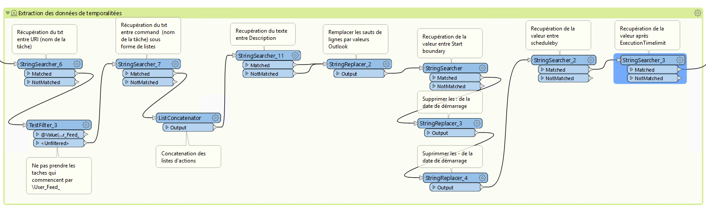

I- Plannificateur de tâches
******************************
 
Dans le cadre de ses missions, le pôle SIG du Département enrichit la base de données épaisse, effectue des mises à jour automatiques (interconnexion aux API via l’ETL FME) et des traitements spécifiques sur la base de données.

Pour cela, des tâches sont programmées via le logiciel 'Task scheduler' de windows.

Avec la multiplication des tâches plannifiées, un traitement FME a été mis en place pour automatiser la création d'un calendrier partagé des tâches windows dans Outlook.

.. image:: ../img/serveur_traitement/task_calendar.gif
   :scale: 50

1 - Normes de saisies sur le plannificateur Windows
==================================================

Afin que l'ensemble des paramètres soient correctement interprété par FME, certaines normes doivent êtres respectées lors de la création/saisie d'une tâche sur windows.

1.1 - Onglet description
-------------------------

* Saisie de la CATEGORIE dans le format suivant : 

   .. code-block:: sql

           CATEGORIE : (Interne ou Entrant ou Sortant).

NE PAS OUBLIER LE POINT A LA FIN !!

* Saisie de la SOURCE des données dans le format suivant : 

   .. code-block:: sql

        SOURCE : (lien ou nom de la/des source(s)) |*

NE PAS OUBLIER LE |* A LA FIN !!

* Saisie de la DESTINATION des données dans le format suivant : 

   .. code-block:: sql

        DESTINATION : (lien ou nom de la/des source(s)) |*

NE PAS OUBLIER LE |* A LA FIN !!

* Saisie du RESUME de la tâche dans le format suivant : 

   .. code-block:: sql

        RESUME : description de la tâche

LE RESUME ET SON CONTENU DOIT TOUJOURS TERMINER LA DESCRIPTION !!

.. image:: ../img/serveur_traitement/0_1_description.png
   :scale: 50

1.2 - Onglet déclencheur
-------------------------

* La date de démarrage doit toujour commencer le même jour que celui programmé (ex : si programmé les lundi, démarrage un lundi ou si programmé le premier vendredi du mois, démarrage un premier vendredi)

.. image:: ../img/serveur_traitement/0_2_date_progra.png
   :scale: 50

* On ne définit pas d'arrêt de la tâche à cette étape (on se sert de l'exécution limite à une autre étape, cela risque de concurencer)

.. image:: ../img/serveur_traitement/0_3_no_limit_in_time.png
   :scale: 50

1.1 - Onglet Paramètres
-----------------------

* Programmer l'arrêt de la tâche en fonction de sa durée réelle (c'est cette limite qui va définir la durée de la tâche : en heures ou en minutes)

.. image:: ../img/serveur_traitement/0_4_execution_time_limit.png
   :scale: 50

2 - Fonctionnement du workbbench FME
====================================

Le workbench FME se trouve `ici <https://github.com/sig14/sig14.github.io/releases/tag/FME_xml_task_windows_scheduler_to_ics>`_

2.1 - Charger les fichiers XML task schduler
---------------------------------------------

A chaque création d'une tâche sur le logiciel 'Task scheduler' de Windows, un fichier xml est enregistré sur C:\Windows\System32\Tasks\*

FME récupère l'ensemble des fichiers XML se trouvant dans ce dossier.

2.2 - Extraction des données de temporalités (REGEXP)
------------------------------------------------------

* Récupération du texte entre les balises **URI** (nom de la tâche)

        .. code-block:: sql

            (?<=<URI>)(.*)(?=<\/URI>)

* Exclure les tâches qui commencent par "\User_Feed_" (tâches par défaut de windows)

* Récupération du texte entre les balises **command** (actions effectuées par la tâche) sous forme de listes

        .. code-block:: sql

            (?<=<Command>)(.*?)(?=<\/Command>)

* Concaténation des listes d'actions

* Récupération du texte entre les balises **Description** (Description de la tâche) sous forme de listes

        .. code-block:: sql

            (?<=<Description>)(.*)(?=<\/Description>)

* remplacer les sauts de lignes des description par des balises **\n** puis saut de ligne (interprétables par Outlook)

* Récupération de la valeur entre les balises **StarBoundary** (heure et date de démarrage de la tâche)

        .. code-block:: sql

             (?<=StartBoundary>)(.*?)(?=<\/StartBoundary)

* Supprimer les **:** et **-** de la date de démarrage (interprétables par Outlook) 

* Récupération de la valeur après balises **SheduleBy** (programmation par interval : mois, jours, années)

        .. code-block:: sql

            (?<=ScheduleBy)(\w*)(?=>)

* Récupération de la valeur après **ExecutionTimeLimit** (limite de temps avant interuption de la tâche)

        .. code-block:: sql

            (?<=ExecutionTimeLimit>)(\w*)

* Récupération de la valeur comprise entre **CATEGORIE** et **.** (catégorie de donénes entrantes, sortantes ou flux internes)

        .. code-block:: sql

            (?<=CATEGORIE :)(.*?)(?=\.)

* Supression des espaces dans le champs catégorie

2.3 - Crétaion des champs pour le listing excel
------------------------------------------------

.. image:: ../img/serveur_traitement/I_8_listing_excel.png
   :scale: 50

* Récupération des valeurs entre DESTINATION et |* (url ou nom de la destination des données)

        .. code-block:: sql

            (?<=DESTINATION :)(.*?)(?=\|\*)

* Créer une valeur vide pour les entités qui n'ont pas de destination renseignée

* Récupération des valeurs entre DSOURCE et |* (url ou nom de la source des données)

        .. code-block:: sql

            (?<=SOURCE :)(.*?)(?=\|\*)

* Créer une valeur vide pour les entités qui n'ont pas de source renseignée

* Récupération des valeurs après RESUME et avant la balise /DESCRIPTION (résumé de la tâche)

        .. code-block:: sql

            (?<=RESUME :)(.*?)(?=<\/Description>)

* Créer une valeur vide pour les entités qui n'ont pas de résumé renseigné

2.4 - Filtre sur les temporalités 
-------------------------------------------

.. image:: ../img/serveur_traitement/I_2_filtre_temporalite.png
   :scale: 50

2.5 - Extraction du détail de temporalité
-------------------------------------------

.. image:: ../img/serveur_traitement/I_3_detail_temporalite.png
   :scale: 50

**Pour les temporalité Day** :

* Récupération des chiffres après la balise **DaysInterval** (interval de jours pour lancement de la tâche)

        .. code-block:: sql

            (?<=<DaysInterval>)(\d*)

**Pour les temporalité Week** :

* Récupération des chifres Entre les balises **WeeksInterval** (interval de semaines pour lancement de la tâche)

        .. code-block:: sql

            (?<=<WeeksInterval>)(.*)(?=<\/WeeksInterval>)

**Pour les temporalité Month** :

* Récupération du texte Entre les balises **Months** (différents mois de lancement de la tâche)

        .. code-block:: sql

            (?<=<Months>)(.*)(?=<\/Months)

* Création de liste avec les textes de mois extraits

        .. code-block:: sql

                (?<=<)(.*?\/>)

* Récupération du chiffre après la balise **Day** (jour des mois de lancement de la tâche)

        .. code-block:: sql

            (?<=<Day>)(\d*)

* Explosion des listes de mois

**Pour les temporalité MonthDayOfWeek** :

* Récupération des chiffres après la balise **Week** (numéro de semaine de lancement)

        .. code-block:: sql

            (?<=<Week>)(\d*)

* Récupération du texte entre les balises **DaysofWeek** (jours de la semaine pour lancement de la tâche)

        .. code-block:: sql

            (?<=<DaysofWeek>)(.*)(?=<\/DaysofWeek)

* Création des valeurs outlook de jours de semaines en fonction des chiffres extraits (nombres et Prefixes)

* Récupération du texte Entre les balises **Months** (différents mois de lancement de la tâche)

        .. code-block:: sql

            (?<=<Months>)(.*)(?=<\/Months)

* Création de liste avec les textes de mois extraits

        .. code-block:: sql

                (?<=<)(.*?\/>)

* Explosion des listes de mois

2.6 - Mise en forme du détail de temporalité
-------------------------------------------

.. image:: ../img/serveur_traitement/I_4_mise_en_forme_detail_temporalite.png
   :scale: 50

* Création du numéro de mois correspondant à la valeur de mois extraite

* Préfixer les attributs **Days** et **Month** en fonction de leur longueur et mise en forme de la date pour Outlook

2.7 - Structuration du texte au format ICS
-------------------------------------------

.. image:: ../img/serveur_traitement/I_5_structuration.png
   :scale: 50

**Pour les temporalité Day** :

BEGIN:VEVENT
CATEGORIES:Journalier
SUMMARY: @Value(task_name)
DTSTART;TZID="Romance Standard Time":@Value(start_time)
RRULE:FREQ=DAILY;INTERVAL=@Value(day_interval)
DURATION:@Value(duration)
DESCRIPTION:
        @Value(description)
LOCATION:@Value(task_actions)
END:VEVENT

**Pour les temporalité Week** :

BEGIN:VEVENT
CATEGORIES:Hebdomadaire
SUMMARY: @Value(task_name)
DTSTART;TZID="Romance Standard Time":@Value(start_time)
RRULE:FREQ=WEEKLY;INTERVAL=@Value(week_interval)
DURATION:@Value(duration)
DESCRIPTION: 
        @Value(description)
LOCATION:@Value(task_actions)
END:VEVENT

**Pour les temporalité Month** :

BEGIN:VEVENT
CATEGORIES:Mensuel
SUMMARY:@Value(task_name)
DTSTART;TZID="Romance Standard Time":@Value(start_time2)
RRULE:FREQ=YEARLY;BYMONTHDAY=@Value(num_day);BYMONTH=@Value(num_month2)
DURATION:@Value(duration)
DESCRIPTION: 
        @Value(description)
LOCATION:@Value(task_actions)
END:VEVENT

**Pour les temporalité MonthDayOfWeek** :

BEGIN:VEVENT
CATEGORIES:Mensuel
SUMMARY:@Value(task_name)
DTSTART;TZID="Romance Standard Time":@Value(start_time2)
RRULE:FREQ=YEARLY;BYDAY=@Value(num_day2);BYMONTH=@Value(num_month2);BYSETPOS=@Value(week)
DURATION:@Value(duration)
DESCRIPTION: 
        @Value(description)
LOCATION:@Value(task_actions)
END:VEVENT

2.8 - Ecriture du fichier ics
-----------------------------

.. image:: ../img/serveur_traitement/I_6_writer.png
   :scale: 50

Dans les paramètres d'attribut du writer, modifier la valeur :

BEGIN:VCALENDAR
VERSION:2.0
@Value(text_line_data)
END:VCALENDAR

Et enregistrer en destination Text file avec suffixe .ics dans le nom.

.. image:: ../img/serveur_traitement/I_7_save_as_ics.png
   :scale: 50

2.9 - Mise en forme Excel
-----------------------------

.. image:: ../img/serveur_traitement/I_9_mise en_forme_excel.png
   :scale: 50

* Création de la périodicité  et de l'interval

**Pour les temporalité Day** :

periodicite : journalier
interval : Tous les @Value(day_interval) jours

**Pour les temporalité Week** :

periodicite : hebdomadaire
interval : Toutes les @Value(week_interval) semaines

**Pour les temporalité Month** :

periodicite : mensuel
interval : 
Le @Value(num_day) des mois de : 
@Value(months)

**Pour les temporalité MonthDayOfWeek** :

periodicite : mesnuel
interval : 
Le @Value(num_day) de la @Value(week) eme semaine des mois de : 
@Value(months)

3 - Ouverture des fichiers 
============================

Dans outlook, importer le calendrier à partir du fichier ICS créé.

.. image:: ../img/serveur_traitement/II_1_import_ics.png
   :scale: 50

En cliquant sur un rendez-vous, vous pouvez consulter :

-	La périodicité des traitements (si paramétrage des catégories dans Outlook : plus bas dans le mail)
-	Le nom de la tâche (objet)
-	L’emplacement de l’action effectuée (emplacement)
-	L’heure de début
-	L’heure de fin (limite d’exécution du traitement)
Dans le corps du RDV :
-	La catégorie d’import/export données : données entrantes, sortantes ou partagées/transférées en interne
-	Le chemin/url sources des données
-	Le chemin/url destination des données
-	Une description du traitement

Vous pouvez définir les catégories dans outlook comme ci-dessous pour visualiser la périodicité des traitements en couleur et les modalités d’imports/export de données (entrants, sortants, interne).

-> Dans Accueil , indicateurs , classer

.. image:: ../img/serveur_traitement/II_1_categories_outlook.png
   :scale: 50

Dans Excel, ouvrir le fichier .xls

.. image:: ../img/serveur_traitement/II_1_result_excel.png
   :scale: 50

